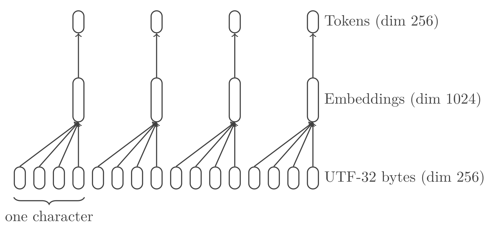

# Tokun-1

> `to-kun` took tokens to t-can

Current tokenizers have notorious issues that are bringing all the LLMs down.
For example I could not get `ChatGPT-3.5` to produce a decent catch-phrase (so you're stuck with mine!).

`tokun` is a NN model specialized in text tokenization.
It produces small graph embeddings that hold all the text information up to the byte level.

This article is the first part of a serie, starting from single character tokenization.
It will follow the improvements of the model, building increasingly meaningful and dense tokens.

## Intuition

OpenAI stated that the [GPT-4 tokens have a length of 4 characters][openai-tokenizer], on average and in English.

With UTF-8, encoding these 4 characters amount to less than 8 bytes in the vast majority of cases.

These 8 bytes are translated into a vector of dimension 100k by a common tokenizer like `cl100`.
If the elements of the vectors are stored as `float32` that's **400k bytes worth of space** for each 4 characters.

That's just the tip of the iceberg.

## State Of The Art Tokenization

Suppose you include the following excerpt in a prompt to `GPT-4o`:

```
Une unité lexicale ou token lexical ou plus simplement token est un couple composé d'un nom et d'une valeur optionnelle (e.g. 135677).
```

Since LLMs don't actually handle text, this sentence has first to be translated to numbers.
This process has several stages: encoding, tokenization and embedding.

For now, consider the [end result from the tokenizer `o200k`][tiktokenizer-o200k] (used in `GPT-4o`): 

| Token         | ID        |
| ------------- | --------- |
| "Une"         | 28821     |
| " unité"      | 181741    |
| " lexi"       | 37772     |
| "cale"        | 135677    |
| " ou"         | 2031      |
| " token"      | 6602      |
| " lexical"    | 173846    |
| " ou"         | 2031      |
| " plus"       | 2932      |
| " simplement" | 45065     |
| " token"      | 6602      |
| " est"        | 893       |
| " un"         | 537       |
| " couple"     | 7167      |
| " composé"    | 98898     |
| " d"          | 272       |
| "'un"         | 9788      |
| " nom"        | 8080      |
| " et"         | 859       |
| " d"          | 272       |
| "'une"        | 13337     |
| " valeur"     | 41664     |
| " option"     | 5317      |
| "nelle"       | 30805     |
| " ("          | 350       |
| "e"           | 68        |
| ".g"          | 1940      |
| "."           | 13        |
| " "           | 220       |
| "135"         | 14953     |
| "677"         | 45835     |
| ")."          | 741       |

The sentence is split into chunks called "tokens", which have a 1:1 match with an ID.
Each tokenizer has its own vocabulary and `o200k` contains 200k identified tokens.

These IDs are not yet edible for a NN: AI models digest tensors, which are glorified arrays.
The trick is to interprete each ID as an index in an array of 200k elements:

```
"." => 13 => [0, 0, 0, 0, 0, 0, 0, 0, 0, 0, 0, 0, 0, 1, 0, ..., 0]
```

This operation is called "one-hot encoding".

It turns the orginal prompt in a `(32, 199998)` tensor:
32 ones for each token and 6399904 zeroes.

## Relation With Performances

### Inference

The encoded input has two axes, the dimensions of which have a direct impact on performance.

First, the number of tokens is related to the batch and context dimensions.
Both of these dimensions define the quantity of information a LLM can process at once.

The prompt of the previous sections had 134 characters, which were reduced to 32 tokens.
It's roughly a compression by a factor 4.

The higher this factor is, the more information the model can fit into a single forward pass / inference.
Conversely, it means that it would take less computing resources to process prompts.

The second axis has a constant dimension of several 100k.
It is directly related to the size of the model, as it will require a neuron for each element.
For example `llama3-8B` has a `128000 x 4096` kernel in its first layer, the embedding, where 128k is the size of the vocabulary.

The size of the model has an overarching impact on the cost.
The number of parameters is a key balance between efficiency and quality.

### Model Training

Since tokens are unrelated to each other, LLMs have to see each variation to build relevant embeddings.
Having been trained on `"hot dog"` does not transfer to `"hotdog"`.

The model would not link the two and fail to understand puns that play with ambiguity.
Unless a similar context for the two wordings happens in the training data, which is a lot to ask.

Since `tokun` embeddings hold the information of each character, the two representations will differ only by a space.
LLMs will not need to be trained on each variation, they would understand the nuances natively.

Although I cannot quantify the magnitude, this will lower the volume of data required to build meaningful embeddings (in pretraining).

## Limitations Of Current Tokenizers

This simple example already brings out a number of quirks.
For example, the input tensor is *very* large and mostly zero??

As Andrej Karpathy [pointed out][youtube-karpathy-tokenizer], there are many more:

- [ ] tokenizers are built and operate outside of the NN models
- [ ] they generalize poorly across languages
- [ ] they result in input vectors with dimensions of several 100k
- [ ] they require the definition of additional "special tokens"
- [ ] words out of the vocabulary are fragmented: `["option", "nelle"]`
- [ ] tokens are a priori unrelated to each other:
    - [ ] characters: `"hello"` has no relation to `"h"` or the ASCII code `104`
    - [ ] capitalization: `"New-York"` and `"new-york"`
    - [ ] typos: `"helllo"` and `"hello"`
    - [ ] repetitions: `"    "` and `"\t"`
    - [ ] inflections:
        - conjugation: `"is"` and `"be"`
        - plural: `"languages"` and `"language"`
        - gender: `"franc"` and `"franche"`
        - cases: genetive, nominative, etc
- [ ] words are tokenized differently depending on their surrounding elements:
    - [ ] `"\thello world"` is split into `["\th", "ello", " world"]` by [GPT-4][tiktokenizer-gpt-4]
    - [ ] while `"hello world"` results in `["hello", " world"]`
- [ ] tokenizers have trouble with numbers:
    - [ ] fragmentation: `"8222.3"` is split into `["822", "2", ".", "3"]`
    - [ ] base: `"0x10"` and `"16"`
    - [ ] format: `"1.6e-1"` and `"0.16"`

Obviously I asked `ChatGPT` if he wanted to add something:

- [ ] dependency on the training data can lead to biases and limit generalization
- [ ] efficiency: some tokenizers can be slow to encode and decode large texts
- [ ] handling of compound words: `"hotdog"` is unrelated to `"hot dog"`

The model `tokun-1` presented here will tackle the first 4 points.
The final model `tokun-4x4` addresses most of these shortcomings.

The serie is heavily focused on western languages, due to personal knowledge.
Still the concepts were tested on asian and middle-eastern languages.

## Proposition

Instead of building vocabularies outside of LLMs, the idea is to train a NN to produce its own embeddings.

The model will learn to compress and decompress text at the same time, *from the raw Unicode bytes*.

Compared to current techniques, both axes will be reduced by several orders:
eventually, the example prompt would be represented as a `(9, 256)` tensor.

## UTF-32 <=> "Better" UTF-8

Just like traditional tokenization, the goal is to compose meaningful tokens from independent bytes.

It starts with the encoding of text characters and symbols, following the [Unicode standard][wiki-unicode].

Usually the translation is performed using UTF, but these schemes do not perfectly fit NN requirements:

| Encoding | Advantages  | Shortcomings |
| ---------| ----------- | ------------ |
| UTF-8    | No gaps     | Varying size |
| UTF-32   | Fixed size  | Null data    |

Having a constant size will allow to split the input text into tensors of fixed shape.

And avoiding null data will help to maximize the information density in the input space.

Actually, we can achieve both goals at once by compressing UTF-32 with a neural network.
This will be the first block layer of the `tokun` model.

## The Model

### Inputs

The input tensor has shape `(B * G, U)`, where:

- `B` is the batch dimension
- `G` is the group dimension, here 4
- `U` is the encoding dimension, 256

The original text samples are preprocessed as follows:

- each text sample is padded with `0x00` to a fixed length (on the right)
- then encoded as UTF-32, which means 4 bytes per character
- all samples are flattened into a one-dimensional tensor
- and finally each byte is represented as a one-hot vector

The main preprocessing step is done in `encode`:

```python
def encode(data: tf.Tensor, token_size: int, sample_size: int=64) -> tf.Tensor:
    # factor 4 because of the UTF-32 encoding
    __dim = math.ceil(4 * sample_size / token_size) * token_size
    # Decode bytes from UTF-8
    __bytes = tf.strings.unicode_transcode(input=data, input_encoding='UTF-8', output_encoding='UTF-32-BE') # (B,)
    # Decode byte strings to arrays of integers
    return tf.io.decode_raw(__bytes, out_type=tf.uint8, fixed_length=__dim) # (B, 4 * S)
```

Where `data` is a tensor of UTF-8 byte objects. 

### Architecture

Overall, the model is a [variational autoencoder][wiki-vae].

The implementation is using Tensorflow, as detailed in the appendices.

#### Encoder

The encoder is a CNN, with stacked dilated convolutions similar the the [WaveNet model][arxiv-wavenet].

Here the dilation factor is 4, with a single hidden layer for this first iteration of the `tokun` model.

This means that the 4 UTF-32 bytes get merged into a single vector, the embedding for the corresponding character.

The latent dimension of the resulting vector `E` is set to 256:
the layer performs a compression of the input space by a factor of 4.



#### Decoder

The decoder performs the reverse operations:

- the 256 vector embeddings are brought back to a dimension of 1024
- and then split into 4 vectors, one for each UTF-32 byte

#### Head

The head applies a softmax on the last axis to compute the probability of each byte.

### Outputs

The softmax probabilities can be easily post-processed with `argmax` to predict the actual byte values:

```python
def interpret(output: tf.Tensor) -> tf.Tensor:
    return tf.argmax(input=output, axis=-1, output_type=tf.dtypes.int32) # uint8 is not allowed

def decode(tokens: tf.Tensor) -> str:
    __b = tf.reshape(tensor=tokens, shape=(-1,)).numpy().tolist()
    return bytes(__b).decode(encoding='utf-32-be', errors='replace')
```

The following function translates the model output back to Unicode strings:

```python
def postprocess(output: tf.Tensor) -> tf.Tensor:
    # from one-hot to UTF-32 bytes
    __output = interpret(output=output)
    # flatten the groups of 4 bytes
    return decode(tokens=__output)
```

## Training

The training was done on:

- the [MLQA][github-mlqa] dataset:
    - using the `context` feature
    - with data in 7 languages: Arabic, English, German, Hindi, simplified Chinese, Spanish and Vietnamese
    - totalling 1721536 character level tokens 
- the ADAM optimizer:
    - on 8 epochs
    - with a learning rate decay from `1e-3` to `1e-4`

```python
TRAINING_HISTORY = MODEL.fit(
    x=TRAIN['ar'].concatenate(TRAIN['en']).concatenate(TRAIN['es']).concatenate(TRAIN['de']).concatenate(TRAIN['hi']).concatenate(TRAIN['vi']).concatenate(TRAIN['zh']),
    batch_size=128,
    epochs=8,
    validation_split=None,
    validation_data=TEST['ar'], # full of glyphs
    validation_freq=list(range(1, 9)),
    verbose=2,
    callbacks=[lr_callback, tb_callback])
```

## Results

For this model to be relevant, it has to be perfectly accurate so that embeddings can be reversed into their matching sequence of characters.

### Metrics

The accuracy reaches 100% on both training and validation datasets:

| Accuracy                  | Loss                     |
| ------------------------- | ------------------------ |
| ![][image-graph-accuracy] | ![][image-graph-loss]    |

Conversely, the loss falls to zero as you can see above.

Even though validation is performed on unknown samples, they are all in the same language.
On the contrary, the training dataset has 7 languages: it is harder to match all the specifics at once.
That's why the model performs better on the validation data.

Since the one-hot input is mostly empty, this simple model is easily able to perform a lossless compression by a factor 4.

### Samples

This first model is 1:1, it looks like it does nothing.
Here's a comparison of input and output on German test samples:

![][image-sample-german]

### Embeddings

The embedding vectors can be visualized using [TSNE][wiki-tsne].
This technique further downscales the vectors of dimension 256 to 3D points that can be directly visualized:

| ASCII                 | Arabic                 |
| --------------------- | ---------------------- |
| ![][image-tsne-ascii] | ![][image-tsne-arabic] |

| Vietnamese                 | CJK-4E                 |
| -------------------------- | ---------------------- |
| ![][image-tsne-vietnamese] | ![][image-tsne-cjk-4e] |

The labels are HEX encoding of the 4 UTF-32-BE bytes.

The model groups the characters according to their alphabet.
This is directly bound to the [Unicode scheme][unicode-table] where the space of the code points is partitioned according to the most significant bytes.

In the images aboves:

- the whole range `0x4E00` - `0x4EFF` is filled with CJK characters and clumped together
- while basic ASCII is in `0x0000` - `0x007F`

Still, part of the model emphasizes the least significant byte.
This produces close embeddings for all characters ending in `0x4C` for example: "L" (`Ox004C`) is actually close to "职" (duty, profession: `0x804C`):

![][image-tsne-4c]

ASCII characters are scattered:
there are relatively few compared to other alphabets, like CJK, so the model did not need to expand much resources to parse them.

It put more emphasis on the "Latin Extended" characters because of their diversity and representation in Vietnamese samples.

### Robustness

The embeddings are **very robust to noise** even when it doesn't respect the underlying structure:

```python
__std = tf.math.reduce_std(EMBEDDINGS[1]['en'], axis=0)
__noise = tf.random.normal(shape=(256,), mean=0., stddev=tf.math.reduce_mean(__std).numpy())

__x = preprocess('toku', groups=[4], flatten=True)
__e = MODEL._encoder(__x)

print(postprocess(MODEL._decoder(__e))) # original embedding
# toku
print(postprocess(MODEL._decoder(__e + __std))) # noise with same structure as an embedding
# toku
print(postprocess(MODEL._decoder(__e + __noise))) # random noise
# toku
print(postprocess(MODEL._decoder(__e + 4 * __noise))) # random noise with more amplitude
# tokn
```

The neighborhoods around each embeddings are consistently decoded into the same token:

| Overview                  | Zoom                              |
| ------------------------- | --------------------------------- |
| ![][image-tsne-neighbors] | ![][image-tsne-neighbors-zoom]    |

The points above were generated by adding random noise to 7 token embeddings taken in each language.
The labels are decoded from these altered embeddings, with the HEX codepoint appended.

The noise has a maximum amplitude of 2 times the standard deviation on embeddings.

This simple model is very resilient, but we will see that susceptibility to noise increases with the compression factor of the model.

## Features

### Special Tokens

Unicode comes with [special characters out-of-the-box][unicode-table]:

| 0000 - 001F                       | 007F - 009F                       |
| --------------------------------- | --------------------------------- |
| ![][image-unicode-table-00-1f]    | ![][image-unicode-table-7f-9f]    |

Many of these special characters are obsolete and can be repurposed as special tokens.

For instance `0x0002` and `0x0003` stand for "start" and "end of text" in Unicode, they are similar to `<|im_start|>` `<|im_end|>` used in GPT-4.

### Input Compression

As explained in the [encoder section](#encoder):

- the input tensor has a shape `(B * G, U)`
- the embedding tensor has a shape `(B, L)`

With:

- `B` is the batch dimension or the number of characters processed
- `G` is the group dimension, 4, which is also the number of bytes per Unicode codepoint
- `U` is the encoding dimension, 256 = `E` = `L`

In short, this first model *compresses the UTF-32 input by a factor 4*.

`B` is related but different from a potential attention context.

### Generalization

#### To New Samples

As illustrated in the section [metrics](#metrics), the model maintains 100% accuracy on new samples.

#### To New Characters (And Languages)

The "context" feature in the MLQA dataset has no occurence of the newline `"\n"` character.
Yet, the encoder-decoder is able to reconstruct the newline from the embedding.

This shows that the model learned the abstract structure of Unicode rather than particular codepoints.

To better evaluate the capacity to generalize, the model is evaluated on Korean samples, which was not available in the training dataset:

```python
__s = """위키백과, 우리 모두의 백과사전.\nt-분포 확률적 임베딩(t-SNE)은 데이터의 차원 축소에 사용되는 기계 학습 알고리즘 중 하나로, 2002년 샘 로이스Sam Rowise와 제프리 힌튼에 의해 개발되었다.[1] t-SNE는 비선형 차원 축소 기법으로, 고차원 데이터를 특히 2, 3차원 등으로 줄여 가시화하는데에 유용하게 사용된다. 구체적으로 t-SNE는 비슷한 데이터는 근접한 2, 3차원의 지점으로, 다른 데이터는 멀리 떨어진 지점으로 맵핑한다."""

__x = tf.one_hot(indices=_encode_scalar(text=__s, layer_count=N_DEPTH, group_size=4, flatten=True), depth=256, axis=-1)
__e = MODEL._encoder(__x)
__p = MODEL(__x)
__y = postprocess(__p)
```

```
# INPUT ################################################################

위키백과, 우리 모두의 백과사전.
t-분포 확률적 임베딩(t-SNE)은 데이터의 차원 축소에 사용되는 기계 학습 알고리즘 중 하나로, 2002년 샘 로이스Sam Rowise와 제프리 힌튼에 의해 개발되었다.[1] t-SNE는 비선형 차원 축소 기법으로, 고차원 데이터를 특히 2, 3차원 등으로 줄여 가시화하는데에 유용하게 사용된다. 구체적으로 t-SNE는 비슷한 데이터는 근접한 2, 3차원의 지점으로, 다른 데이터는 멀리 떨어진 지점으로 맵핑한다.

# OUTPUT ###############################################################

輄沤蜱諼, 綰醬 推ِ魘 蜱諼芬鰄.
t-掄瓬 晕酠鰁 閄螠圩(t-SNE)镀 հ年礰魘 伨矐 憕閌囐 芬瞩舘媔 र諄 桙隵 噌鿠醬冘 儑 桘窘艜, 2002坄 泘 艜年綤Sam Rowiseी 蘜射醬 岌芼囐 魘桴 尜萜舘蛈绤.[1] t-SNE媔 摄舠 伨矐 憕閌 र螕帼艜, 鿠伨矐 հ年礰酼 芹岈 2, 3伨矐 英帼艜 谄独 鼀시T桘媔հ囐 鬠瞩桘岌 芬瞩舜绤. 坬纴鰁帼艜 t-SNE媔 摄綷桜 հ年礰媔 鿼蘑桜 2, 3伨矐魘 净蘐帼艜, 绤酸 հ年礰媔 捀醬 推嚴賄 净蘐帼艜 闵॑桜绤.

# SCORE ################################################################

0.39307535641547864
```

The model is showing its limits: only 40% of the output characters were correct, Korean was reconstructed as Chinese.

Still it could be trained to encode Korean too, with a suiting dataset.

## Next

Now that we have a fixed size encoding to replace UTF-8, input sequences can be split in regular chunks without padding.

In the next article, these character level embeddings will be combined into longer tokens / embeddings.
We will also study the topology of the token space to determine whether the vectors are just arbitrary IDs or meaningful information.

## Resources

Other articles in the serie:

- [tokun-4][article-github-tokun-4]
- [tokun-16][article-github-tokun-16]

All the variants of the model are already available on:

- [Github][tokun-github]

You will also find notebooks on:

- [Github][notebook-github]
- [Google Colab][notebook-colab]

## Implementation Details

### Reshaping Layer

This model requires a custom reshaping layer to modify the batch dimension:

```python
class Reshape(tf.keras.layers.Layer):
    def __init__(
        self,
        target_shape: tuple,
        **kwargs
    ) -> None:
        super(Reshape, self).__init__(**kwargs)
        self._shape = target_shape

    def call(self, inputs: tf.Tensor, **kwargs) -> tf.Tensor:
        return tf.reshape(inputs, self._shape)
```

### Encoder

The bias of the last dense layer acts as a positional embedding:

```python
class Encoder(tf.keras.models.Model):
    def __init__(self, token_dim: int, encoding_dim: int, embedding_dim: int, latent_dim: int, batch_dim: int=None, **kwargs) -> None:
        super(Encoder, self).__init__(**kwargs)
        self._encoder = tf.keras.Sequential([
            tf.keras.Input(shape=(encoding_dim,), batch_size=batch_dim, name='input'), # (B * G, U)
            tf.keras.layers.Dense(units=embedding_dim, activation=None, use_bias=False, kernel_initializer='glorot_uniform', bias_initializer=None, name='embed-1'), # (B * G, U) => (B * G, E)
            _mtl.Reshape(target_shape=(-1, token_dim * embedding_dim), name='concat-4'), # (B * G, E) => (B, G * E)
            tf.keras.layers.Dense(units=embedding_dim, activation='relu', use_bias=True, kernel_initializer='glorot_uniform', bias_initializer='zeros', name='compress-4'),]) # (B, G * E) => (B, L)

    def call(self, x: tf.Tensor) -> tf.Tensor:
        return self._encoder(x)
```

### Decoder:

The decoder is mostly the same in reverse order:

```python
class Decoder(tf.keras.models.Model):
    def __init__(self, token_dim: int, encoding_dim: int, embedding_dim: int, latent_dim: int, batch_dim: int=None, **kwargs) -> None:
        super(Decoder, self).__init__(**kwargs)
        self._decoder = tf.keras.Sequential([
            tf.keras.Input(shape=(latent_dim,), batch_size=batch_dim, name='input'),
            tf.keras.layers.Dense(units=token_dim * embedding_dim, activation='relu', use_bias=True, kernel_initializer='glorot_uniform', bias_initializer='zeros', name='decompress-4'), # (B, L) => (B, G * E)
            _mtl.Reshape(target_shape=(-1, embedding_dim), name='split-4'), # (B, G * E) => (B * G, E)
            tf.keras.layers.Dense(units=encoding_dim, activation=None, use_bias=True, kernel_initializer='glorot_uniform', bias_initializer='zeros', name='project-head'), # (B * G, E) => (B * G, U)
            tf.keras.layers.Softmax(axis=-1, name='softmax')]) # probabilities

    def call(self, x: tf.Tensor) -> tf.Tensor:
        return self._decoder(x)
```

### Autoencoder

The overall model trains both encoder and decoder at the same time:

```python
class AutoEncoder(tf.keras.models.Model):
    def __init__(self, token_dim: int, encoding_dim: int, embedding_dim: int, latent_dim: int, batch_dim: int=None, **kwargs) -> None:
        super(AutoEncoder, self).__init__(**kwargs)
        self._encoder = Encoder(token_dim=token_dim, encoding_dim=encoding_dim, embedding_dim=embedding_dim, latent_dim=latent_dim, batch_dim=batch_dim)
        self._decoder = Decoder(token_dim=token_dim, encoding_dim=encoding_dim, embedding_dim=embedding_dim, latent_dim=latent_dim, batch_dim=batch_dim)

    def call(self, x: tf.Tensor) -> tf.Tensor:
        return self._decoder(self._encoder(x))
```

But they are actually used separately to tokenize before a LLM and then detokenize on its output.

[arxiv-wavenet]: https://arxiv.org/pdf/1609.03499.pdf
[github-mlqa]: https://github.com/facebookresearch/MLQA
[openai-tokenizer]: https://platform.openai.com/tokenizer
[tiktokenizer-gpt-4]: https://tiktokenizer.vercel.app/?model=gpt-4
[tiktokenizer-o200k]: https://tiktokenizer.vercel.app/?model=o200k_base
[unicode-table]: https://symbl.cc/en/unicode-table/
[youtube-karpathy-tokenizer]: https://www.youtube.com/watch?v=zduSFxRajkE

[article-github-tokun-4]: https://github.com/apehex/tokun/blob/main/articles/tokun.4.md
[article-github-tokun-16]: https://github.com/apehex/tokun/blob/main/articles/tokun.16.md

[image-block-encoder]: .images/block-encoder.png
[image-graph-accuracy]: .images/1/graph.accuracy.png
[image-graph-loss]: .images/1/graph.loss.png
[image-sample-german]: .images/1/sample.german.png
[image-unicode-table-00-1f]: .images/unicode-table.special-tokens.00-1f.png
[image-unicode-table-7f-9f]: .images/unicode-table.special-tokens.7f-9f.png

[image-tsne-4c]: .images/1/tsne.4c.png
[image-tsne-arabic]: .images/1/tsne.arabic.png
[image-tsne-ascii]: .images/1/tsne.ascii.png
[image-tsne-neighbors]: .images/1/tsne.neighbors.png
[image-tsne-neighbors-zoom]: .images/1/tsne.neighbors.zoom.png
[image-tsne-vietnamese]: .images/1/tsne.vietnamese.png
[image-tsne-cjk-4e]: .images/1/tsne.cjk.4e.png

[notebook-colab]: https://colab.research.google.com/github/apehex/tokun/blob/main/notebooks/tokun.1.ipynb
[notebook-github]: https://github.com/apehex/tokun/blob/main/notebooks/tokun.1.ipynb
[notebook-huggingface]: https://github.com/apehex/tokun
[notebook-kaggle]: https://github.com/apehex/tokun

[tokun-github]: https://github.com/apehex/tokun
[tokun-kaggle]: https://github.com/apehex/tokun

[wiki-unicode]: https://en.wikipedia.org/wiki/Unicode
[wiki-vae]: https://en.wikipedia.org/wiki/Variational_autoencoder
[wiki-tsne]: https://en.wikipedia.org/wiki/T-distributed_stochastic_neighbor_embedding
