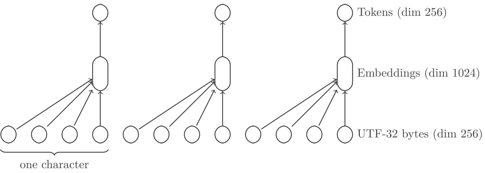

# Tokun-1

> `to-kun` took tokens to t-can

Current tokenizers have notorious issues that are bringing all the LLMs down.
For example I could not get ChatGPT to produce a decent catch-phrase (so you're stuck with mine!).

`tokun` is a NN model specialized in text tokenization.
It produces 256-embedding vectors with a 1:1 match to 64 UTF-32 bytes.

IE each `tokun` embedding can be thought of as a token of length 16.
But these vectors keep meaningful information on their constituting parts.

This article is the first part of a serie, starting from single character tokenization.
It will follow the improvements of the model, building increasingly meaningful and dense tokens.

## Resources

Other articles in the serie:

- [`tokun-4`][github-article-tokun-4]
- [`tokun-16`][github-article-tokun-16]

All the variants of the model are already available on:

- [Github][github-tokun]
- [Hugging Face][huggingface-tokun]
- [Kaggle][kaggle-tokun]

You will also find notebooks on:

- [Github][github-notebook]
- [Hugging Face][huggingface-notebook]
- [Kaggle][kaggle-notebook]

## Limitations Of Current Tokenizers

This project was inspired by a recent (2024) video from Andrej Karpathy, ["Let's build the GPT tokenizer"][youtube-karpathy-tokenizer].

In particular, he listed some issues with current (public) tokenizers:

1. [ ] tokenizers are built and operate outside of the NN models
2. [ ] they generalize poorly across languages
3. [ ] they result in input vectors with dimensions of several 100k
4. [ ] tokens are a priori unrelated to each other:
    4.1. [ ] `"hello"` has no relation to `"h"` or the ASCII code `104`
    4.2. [ ] capitalization: `"New-York"` and `"new York"`
    4.3. [ ] typos: `"helllo"` and `"hello"`
    4.4. [ ] repetitions: `"    "` and `"\t"`
    4.5. [ ] inflections:
        - conjugation: `"is"` and `"be"`
        - plural: `"languages"` and `"language"`
        - gender: `"franc"` and `"franche"`
        - cases: genetive, nominative, etc
5. [ ] words are tokenized differently depending on their surrounding elements:
    5.1. [ ] `"\thello world"` is split into `["\th", "ello", " world"]` by [GPT-4][tiktokenizer-gpt-4]
    5.2. [ ] while `"hello world"` results in `["hello", " world"]`
6. [ ] tokenizers have trouble with numbers:
    6.1. [ ] fragmentation: `"8222.3"` is split into `["822", "2", ".", "3"]`
    6.2. [ ] base: `"0x10"` and `"16"`
    6.3. [ ] format: `"1.6e-1"` and `"0.16"`

The model `tokun-1` presented here will tackle the first 3 points.
The final model `tokun-4x4` addresses most of these shortcomings.

The serie is heavily focused on western languages, due to personal knowledge.
Still the concepts were tested on asian and middle-eastern languages.

## UTF-32 <=> "Better" UTF-8

Just like traditional tokenization, the goal is to compose meaningful tokens from independent bytes.

It starts with the encoding of text characters and symbols, following the [Unicode standard][wiki-unicode].

Usually the translation is performed using UTF, but these schemes do not perfectly fit NN requirements:

| Encoding | Advantages  | Shortcomings |
| ---------| ----------- | ------------ |
| UTF-8    | No gaps     | Varying size |
| UTF-32   | Fixed size  | Null data    |

Having a constant size will allow to split the input text into tensors of fixed shape.

And avoiding null data will help to maximize the information density in the input space.

Actually, we can achieve both goals at once by compressing UTF-32 with a neural network.
This will be the first block layer of the `tokun` model.

## The Model

### Inputs

The input tensor has shape `(B * G, U)`, where:

- `B` is the batch dimension
- `G` is the group dimension, here 4
- `U` is the encoding dimension, 256

The original text samples are preprocessed as follows:

- each text sample is padded with `0x00` to a fixed length (on the right)
- then encoded as UTF-32, which means 4 bytes per character
- all samples are flattened into a one-dimensional tensor
- and finally each byte is represented as a one-hot vector

Most of preprocessing is done in `encode`:

```python
def encode(data: tf.Tensor, layer_count: int=1, group_size: int=4, sample_size: int=64, flatten: bool=False) -> tf.Tensor:
    # make sure each sample has a length multiple of G ** L = T, the token dim
    __mod = group_size ** layer_count
    __dim = math.ceil(4 * sample_size / __mod) * __mod # factor 4 because of the UTF-32 encoding
    # output shape
    __shape = shape(layer_count=layer_count, group_size=group_size, flatten=flatten)
    # Decode bytes from UTF-8
    __bytes = tf.strings.unicode_transcode(input=data, input_encoding='UTF-8', output_encoding='UTF-32-BE') # (B,)
    # Decode byte strings to arrays of integers
    __ints = tf.io.decode_raw(__bytes, out_type=tf.uint8, fixed_length=__dim) # (B, 4 * S)
    # group the characters into tokens
    return tf.reshape(tensor=__ints, shape=__shape) # for example (-1, G, G, G) the first dimension is not B
```

Where `data` is a tensor of UTF-8 byte objects. 

### Architecture

Overall, the model is a [variational autoencoder][wiki-vae].

The implementation is using Tensorflow, as detailed in the appendices.

#### Encoder

The encoder is a CNN, with stacked dilated convolutions similar the the [WaveNet model][arxiv-wavenet].

Here the dilation factor is 4, with a single hidden layer for this first iteration of the `tokun` model.

This means that the 4 UTF-32 bytes get merged into a single vector, the embedding for the corresponding character.

The latent dimension of the resulting vector `E` is set to 256:
the layer performs a compression of the input space by a factor of 4.



#### Decoder

The decoder performs the reverse operations:

- the 256 vector embeddings are brought back to a dimension of 1024
- and then split into 4 vectors, one for each UTF-32 byte

#### Head

The head applies a softmax on the last axis to compute the probability of each byte.

#### Outputs

The softmax probabilities can be easily post-processed with `argmax` to predict the actual byte values:

```python
def interpret(output: tf.Tensor) -> tf.Tensor:
    return tf.argmax(input=output, axis=-1, output_type=tf.dtypes.int32) # uint8 is not allowed

def decode(tokens: tf.Tensor) -> str:
    __b = tf.reshape(tensor=tokens, shape=(-1,)).numpy().tolist()
    return bytes(__b).decode(encoding='utf-32-be', errors='replace')
```

The following function translates the model output back to unicode strings:

```python
def postprocess(output: tf.Tensor) -> tf.Tensor:
    # from one-hot to UTF-32 bytes
    __output = interpret(output=output)
    # flatten the groups of 4 bytes
    return decode(tokens=__output)
```

## Training

The training was done on:

- the [MLQA][github-mlqa] dataset:
    - using the `context` feature
    - with data in 7 languages: Arabic, English, German, Hindi, simplified Chinese, Spanish and Vietnamese
    - totalling 1721536 character level tokens 
- the ADAM optimizer:
    - on 8 epochs
    - with a learning rate rampup and decay from `1e-3` to `1e-4`

```python
TRAINING_HISTORY = MODEL.fit(
    x=TRAIN['ar'].concatenate(TRAIN['en']).concatenate(TRAIN['es']).concatenate(TRAIN['de']).concatenate(TRAIN['hi']).concatenate(TRAIN['vi']).concatenate(TRAIN['zh']),
    batch_size=128,
    epochs=8,
    validation_split=None,
    validation_data=TEST['ar'], # full of glyphs
    validation_freq=list(range(1, 9)),
    verbose=2,
    callbacks=[lr_callback, tb_callback])
```

## Results

### Metrics

The accuracy reaches 100% on both training and validation datasets:

| Accuracy                  | Loss                     |
| ------------------------- | ------------------------ |
| ![][image-graph-accuracy] | ![][image-graph-loss]    |

Conversely, the loss falls to zero as you can see above.

Even though validation is performed on unknown samples, they are all in the same language.
On the contrary, the training dataset has 7 languages: it is harder to match all the specifics at once.
That's why the model performs better on the validation data.

Since the one-hot input is mostly empty, this simple model is easily able to perform a lossless compression by a factor 4.

### Samples

Since this first model is 1:1, it looks like it does nothing.
A comparison of input and output on German test samples:

![][image-sample-german]

### Embeddings

The embedding vectors can be visualized using [TSNE][wiki-tsne].
This technique further downscales the vectors of dimension 256 to 3D points that can be directly visualized:

| ASCII                 | Arabic                 |
| --------------------- | ---------------------- |
| ![][image-tsne-ascii] | ![][image-tsne-arabic] |

| Vietnamese                 | CJK-4E                 |
| -------------------------- | ---------------------- |
| ![][image-tsne-vietnamese] | ![][image-tsne-cjk-4e] |

The labels are HEX encoding of the 4 UTF-32-BE bytes.

The model groups the characters according to their alphabet.
This is directly bound to the [unicode scheme][unicode-table] where the space of the code points is partitioned according to the most significant bytes.

In the images aboves:

- the whole range `0x4E00` - `0x4EFF` is filled with CJK characters and clumped together
- while basic ASCII is in `0x0000` - `0x007F`

Still, part of the model emphasizes the least significant byte.
This produces close embeddings for all characters ending in `0x4C` for example: "L" (`Ox004C`) is actually close to "职" (duty, profession: `0x804C`):

![][image-tsne-4c]

ASCII characters are scattered:
there are relatively few compared to other alphabets, like CJK, so the model did not need to expand much resources to parse them.

It put more emphasis on the "Latin Extended" characters because of their diversity and representation in Vietnamese samples.

### Generalization Power

#### New Samples

As illustrated in the section [metrics](#metrics), the model maintains 100% accuracy on new samples.

#### New Characters And Languages

The "context" feature in the MLQA dataset has no occurence of the newline `"\n"` character.
Yet, the encoder-decoder is able to reconstruct the newline from the embedding.

This shows that the model learned the abstract structure of unicode rather than particular codepoints.

To better evaluate the capacity to generalize, the model is evaluated on Korean samples, which was not available in the training dataset:

```python
__s = """위키백과, 우리 모두의 백과사전.\nt-분포 확률적 임베딩(t-SNE)은 데이터의 차원 축소에 사용되는 기계 학습 알고리즘 중 하나로, 2002년 샘 로이스Sam Rowise와 제프리 힌튼에 의해 개발되었다.[1] t-SNE는 비선형 차원 축소 기법으로, 고차원 데이터를 특히 2, 3차원 등으로 줄여 가시화하는데에 유용하게 사용된다. 구체적으로 t-SNE는 비슷한 데이터는 근접한 2, 3차원의 지점으로, 다른 데이터는 멀리 떨어진 지점으로 맵핑한다.\n\nt-SNE 알고리즘은 두 단계에 걸쳐서 진행된다. 첫번째로, 각 데이터 쌍에 대해서 결합분포를 만든다. 이 분포는 비슷한 데이터는 선택될 확률이 매우 높지만 다른 데이터끼리는 선택될 확률이 매우 낮도록 설계된다.\n\nt-SNE는 컴퓨터 보안,[2] 음악 분석,[3] 암 연구,[4] 생물정보학,[5] 생체신호처리[6] 등 너른 분야에서 데이터의 시각화를 위해 사용된다.인공 신경망의 상위 계층을 표현하는데 쓰이기도 한다.[7]"""

__x = tf.one_hot(indices=_encode_scalar(text=__s, layer_count=N_DEPTH, group_size=4, flatten=True), depth=256, axis=-1)
__e = MODEL._encoder(__x)
__p = MODEL(__x)
__y = postprocess(__p)

print('# INPUT ################################################################\n\n' + __s)
print('\n\n# OUTPUT ###############################################################\n\n' + __y)
print('\n\n# SCORE ################################################################\n\n' + str(compare(__s, __y)))
```

```
# INPUT ################################################################

위키백과, 우리 모두의 백과사전.
t-분포 확률적 임베딩(t-SNE)은 데이터의 차원 축소에 사용되는 기계 학습 알고리즘 중 하나로, 2002년 샘 로이스Sam Rowise와 제프리 힌튼에 의해 개발되었다.[1] t-SNE는 비선형 차원 축소 기법으로, 고차원 데이터를 특히 2, 3차원 등으로 줄여 가시화하는데에 유용하게 사용된다. 구체적으로 t-SNE는 비슷한 데이터는 근접한 2, 3차원의 지점으로, 다른 데이터는 멀리 떨어진 지점으로 맵핑한다.

t-SNE 알고리즘은 두 단계에 걸쳐서 진행된다. 첫번째로, 각 데이터 쌍에 대해서 결합분포를 만든다. 이 분포는 비슷한 데이터는 선택될 확률이 매우 높지만 다른 데이터끼리는 선택될 확률이 매우 낮도록 설계된다.

t-SNE는 컴퓨터 보안,[2] 음악 분석,[3] 암 연구,[4] 생물정보학,[5] 생체신호처리[6] 등 너른 분야에서 데이터의 시각화를 위해 사용된다.인공 신경망의 상위 계층을 표현하는데 쓰이기도 한다.[7]


# OUTPUT ###############################################################

輄沤蜱諼, 綰醬 推ِ魘 蜱諼芬鰄.
t-掄瓬 晕酠鰁 閄螠圩(t-SNE)镀 հ年礰魘 伨矐 憕閌囐 芬瞩舘媔 र諄 桙隵 噌鿠醬冘 儑 桘窘艜, 2002坄 泘 艜年綤Sam Rowiseी 蘜射醬 岌芼囐 魘桴 尜萜舘蛈绤.[1] t-SNE媔 摄舠 伨矐 憕閌 र螕帼艜, 鿠伨矐 հ年礰酼 芹岈 2, 3伨矐 英帼艜 谄独 鼀시T桘媔հ囐 鬠瞩桘岌 芬瞩舜绤. 坬纴鰁帼艜 t-SNE媔 摄綷桜 հ年礰媔 鿼蘑桜 2, 3伨矐魘 净蘐帼艜, 绤酸 հ年礰媔 捀醬 推嚴賄 净蘐帼艜 闵॑桜绤.

t-SNE 噌鿠醬冘镀 ِ 嫨諄囐 齸凐舜 賄碉舜绤. 纫螈賸艜, 鼁 հ年礰 礍囐 Ḁ桴舜 誰物掄瓬酼 里۠绤. 年 掄瓬媔 摄綷桜 հ年礰媔 舠僝舠 晕酠年 釤綰 垒净里 绤酸 հ年礰艼醬媔 舠僝舠 晕酠年 釤綰 芮ׄ牝 爤諄舜绤.

t-SNE媔 蟴曨礰 蟴艈,[2] 祌婅 掄锝,[3] 艔 觰坬,[4] 苝圼谕蟴桙,[5] 苝纴绠猸侘醬[6] 英 褈酸 掄艼囐舜 հ年礰魘 시鼁T酼 輄桴 芬瞩舜绤.鹸鿵 绠龽針魘 苁輄 諄蜵幄 \萄桘媔հ 埰年रׄ 桜绤.[7]


# SCORE ################################################################

0.39307535641547864
```

The model is showing its limits: only 40% of the output characters were correct, Korean was reconstructed as Chinese.

Still it could be trained to encode Korean too, with a suiting dataset.

## Next

Now that we have a fixed size encoding to replace UTF-8, input sequences can be split in regular chunks without padding.

In the next article, these character level embeddings will be combined into longer tokens / embeddings.
We will also study the topology of the token space to determine whether the vectors are just arbitrary IDs or meaningful information.

## Implementation Details

### Reshaping Layer

This model requires a custom reshaping layer to modify the batch dimension:

```python
class Reshape(tf.keras.layers.Layer):
    def __init__(
        self,
        target_shape: tuple,
        **kwargs
    ) -> None:
        super(Reshape, self).__init__(**kwargs)
        self._shape = target_shape

    def call(self, inputs: tf.Tensor, **kwargs) -> tf.Tensor:
        return tf.reshape(inputs, self._shape)
```

### Encoder

The bias of the last dense layer acts as a positional embedding:

```python
class Encoder(tf.keras.models.Model):
    def __init__(self, token_dim: int, encoding_dim: int, embedding_dim: int, latent_dim: int, batch_dim: int=None, **kwargs) -> None:
        super(Encoder, self).__init__(**kwargs)
        self._encoder = tf.keras.Sequential([
            tf.keras.Input(shape=(encoding_dim,), batch_size=batch_dim, name='input'), # (B * G, U)
            tf.keras.layers.Dense(units=embedding_dim, activation=None, use_bias=False, kernel_initializer='glorot_uniform', bias_initializer=None, name='embed-1'), # (B * G, U) => (B * G, E)
            _mtl.Reshape(target_shape=(-1, token_dim * embedding_dim), name='concat-4'), # (B * G, E) => (B, G * E)
            tf.keras.layers.Dense(units=embedding_dim, activation='relu', use_bias=True, kernel_initializer='glorot_uniform', bias_initializer='zeros', name='compress-4'),]) # (B, G * E) => (B, L)

    def call(self, x: tf.Tensor) -> tf.Tensor:
        return self._encoder(x)
```

### Decoder:

```python
class Decoder(tf.keras.models.Model):
    def __init__(self, token_dim: int, encoding_dim: int, embedding_dim: int, latent_dim: int, batch_dim: int=None, **kwargs) -> None:
        super(Decoder, self).__init__(**kwargs)
        self._decoder = tf.keras.Sequential([
            tf.keras.Input(shape=(latent_dim,), batch_size=batch_dim, name='input'),
            tf.keras.layers.Dense(units=token_dim * embedding_dim, activation='relu', use_bias=True, kernel_initializer='glorot_uniform', bias_initializer='zeros', name='decompress-4'), # (B, L) => (B, G * E)
            _mtl.Reshape(target_shape=(-1, embedding_dim), name='split-4'), # (B, G * E) => (B * G, E)
            tf.keras.layers.Dense(units=encoding_dim, activation=None, use_bias=True, kernel_initializer='glorot_uniform', bias_initializer='zeros', name='project-head'), # (B * G, E) => (B * G, U)
            tf.keras.layers.Softmax(axis=-1, name='softmax')]) # probabilities

    def call(self, x: tf.Tensor) -> tf.Tensor:
        return self._decoder(x)
```

### Autoencoder

```python
class AutoEncoder(tf.keras.models.Model):
    def __init__(self, token_dim: int, encoding_dim: int, embedding_dim: int, latent_dim: int, batch_dim: int=None, **kwargs) -> None:
        super(AutoEncoder, self).__init__(**kwargs)
        self._encoder = Encoder(token_dim=token_dim, encoding_dim=encoding_dim, embedding_dim=embedding_dim, latent_dim=latent_dim, batch_dim=batch_dim)
        self._decoder = Decoder(token_dim=token_dim, encoding_dim=encoding_dim, embedding_dim=embedding_dim, latent_dim=latent_dim, batch_dim=batch_dim)

    def call(self, x: tf.Tensor) -> tf.Tensor:
        return self._decoder(self._encoder(x))
```

[arxiv-wavenet]: https://arxiv.org/pdf/1609.03499.pdf
[tiktokenizer-gpt-4]: https://tiktokenizer.vercel.app/?model=gpt-4
[unicode-table]: https://symbl.cc/en/unicode-table/
[youtube-karpathy-tokenizer]: https://www.youtube.com/watch?v=zduSFxRajkE

[github-article-tokun-4]: https://github.com/apehex/tokun/blob/main/articles/tokun.4.md
[github-article-tokun-16]: https://github.com/apehex/tokun/blob/main/articles/tokun.16.md
[github-mlqa]: https://github.com/facebookresearch/MLQA
[github-notebook]: https://github.com/apehex/tokun/blob/main/notebooks/tokun.1.ipynb
[github-tokun]: https://github.com/apehex/tokun

[huggingface-notebook]: https://github.com/apehex/tokun
[huggingface-tokun]: https://github.com/apehex/tokun

[image-block-encoder]: .images/block-encoder.png
[image-graph-accuracy]: .images/1/graph.accuracy.png
[image-graph-loss]: .images/1/graph.loss.png
[image-sample-german]: .images/1/sample.german.png

[image-tsne-4c]: .images/1/tsne.4c.png
[image-tsne-arabic]: .images/1/tsne.arabic.png
[image-tsne-ascii]: .images/1/tsne.ascii.png
[image-tsne-vietnamese]: .images/1/tsne.vietnamese.png
[image-tsne-cjk-4e]: .images/1/tsne.cjk.4e.png

[kaggle-notebook]: https://github.com/apehex/tokun
[kaggle-tokun]: https://github.com/apehex/tokun

[wiki-unicode]: https://en.wikipedia.org/wiki/Unicode
[wiki-vae]: https://en.wikipedia.org/wiki/Variational_autoencoder
[wiki-tsne]: https://en.wikipedia.org/wiki/T-distributed_stochastic_neighbor_embedding
