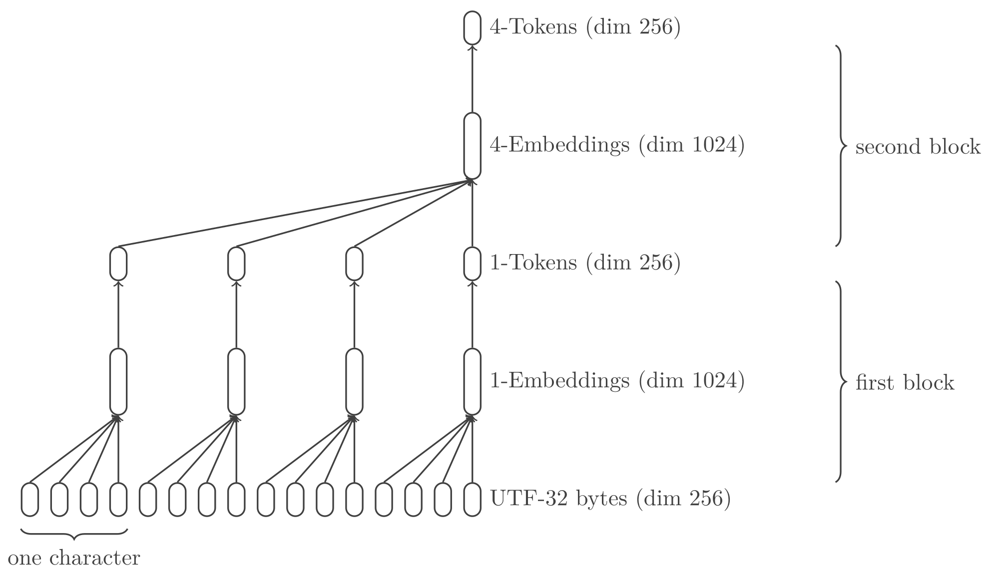

# Tokun-4

> `tokun` to can tokens

Current tokenizers have notorious issues that are bringing all the LLMs down.

The model presented in the [previous article][article-github-tokun-1] made the case for using UTF-32-BE as text encoding.
`tokun-1` is able to perform a lossless compression of UTF-32-BE into a dense equivalent to UTF-8.

The process can be iterated to merge the characters into embeddings 4 by 4.

For reference, OpenAI stated that the [GPT-4 tokenizer has a length of 4 characters on average][openai-tokenizer] and on English.
So `tokun-4` has comparable sequence compression capabilities, while producing shorter and more meaningful embedding vectors.

## Intuition

The base of all `tokun` models is the UTF-32-BE scheme:
each Unicode character is encoded with 4 bytes.

`tokun-4` offers to merge every 4 characters into a `float32` vector of dimension 256.
In short 16 input bytes are represented by 1024 output bytes.

In comparison, current tokenizer use several 100k bytes per token.
While it is significantly more efficient than current tokenizers, it is far from the limit.

So it is expected that the compression performed by the encoder of `tokun-4` is reversible without loss.

## Showcase

Before diving into the details of the model, let's see how it handles the prompt:

```
Une unité lexicale ou token lexical ou plus simplement token est un couple composé d'un nom et d'une valeur optionnelle (e.g. 135677).
```

Even though it was not trained on French, the model can encode and decode the sample without errors:

```python
__s = """Une unité lexicale ou token lexical ou plus simplement token est un couple composé d'un nom et d'une valeur optionnelle (e.g. 135677)."""
__x = tokun.pipeline.preprocess(text=__s, groups=N_TOKEN_DIM, flatten=True) # input = UTF-32-BE bytes as one-hot vectors
__e = MODEL._encoder(__x) # embedding = tokens
__p = MODEL._decoder(__e) # output = probabilities for each byte
__y = tokun.pipeline.postprocess(__p) # text = interpreted probabilities
```

```
Une unité lexicale ou token lexical ou plus simplement token est un couple composé d'un nom et d'une valeur optionnelle (e.g. 135677).
Une unité lexicale ou token lexical ou plus simplement token est un couple composé d'un nom et d'une valeur optionnelle (e.g. 135677).��
1.0
```

The variable `__e` is the embedding, the tensor that would be fed to a LLM.
Contrary to traditional tokens, the output of `tokun` is not directly interpretable:

```python
print(len(__s))
# 134
print(__e.shape)
# (34, 256)
tf.print(__e[:4, :8], summarize=-1)
# [[3.17276168 1.53056908 2.41119337 0.0258403085 1.5207386 1.66698301 2.24263883 2.11223722]
#  [2.65205669 1.68546355 2.01416564 0.655108571 2.3957293 1.70228446 2.12328672 2.04205203]
#  [2.4943645 0.441500723 1.79073346 2.31724644 1.87132716 1.36434507 3.37104845 2.3522613]
#  [2.87078524 1.11898732 2.12827492 0.995271683 0.403087556 0.974042118 1.82035911 2.90426946]]
```

Still, the vectors / tokens can be mapped to 3D and understood to some extent:

| Accents                       | Symbols                       |
| ----------------------------- | ----------------------------- |
| ![][image-tsne-token-accents] | ![][image-tsne-token-symbols] |

The images above are 2 views from the UMAP plot of embeddings.
These embeddings are the representation of the French page on [VAE models][wiki-vae-fr].

On the right, the selected point is labeled `"𝑞\nΦ\n"`, it is the embedding for a portion of a LaTeX equation.
Inded, the input was a raw copy-paste of the article so the equation symbols were spread across several lines:

```latex
{\displaystyle p_{\theta }(\mathbf {x} )=\int _{\mathbf {z} }p_{\theta }(\mathbf {x,z} )\,d\mathbf {z} ,}
où 
𝑝
𝜃
(
𝑥
,
𝑧
)
```

Hence the newlines `"\n"` in the labels.

Despite the quirks of the inputs, `tokun-4` decodes the embeddings with 99% accuracy, only missing a few Greek symbols in the equations.

It was not trained on any code, French nor Greek: it is performing well across languages.
In any case, the few errors should be easily remediated with a more complete training dataset.

Also the latent space shows structure: the model has learnt the Unicode scheme and more than 7 languages.

## Roadmap

The VAE model `tokun-1` could be used as a tokenizer that:

- [x] is an actual neural network
- [x] generalizes across all languages
- [x] produces embeddings of dimension 256
- [x] comes with built-in special tokens

The goal is to maintain these properties in `tokun-4` while solving some of the remaining issues:

- [ ] words out of vocabulary are fragmented
- [ ] tokens are unrelated to each other
- [ ] token are unrelated to their own parts
- [ ] words are tokenized differently depending on their surrounding elements

## Model

The overall model is still a VAE with convolution layers.

Since it is very similar to the first iteration, only the macroscopic structure and the variations will be described.

### Inputs

The training and inference inputs have different specifics but result in similar tensors.

Before the preprocessing pipeline, the inputs have the shape `(B, S)`. With:

- `B` the batch dimension
- `S` the fixed sample dimension:
    - in number of unicode characters
    - with 0 padding on the right

After preprocessing, the input is reshaped into `(B * S * 4, 256)`:

- it is a flat sequence of bytes
- where each byte has dimension 256 because of the one-hot encoding
- the factor 4 comes from the UTF-32-BE encoding of each unicode character

During inference, the input tensor has just `(S * 4, 256)` elements.

From the point of view of the model, the dimension of the first axis will be written `B' * G * G`.
This is because the batch dimension `B * S * 4` will be compressed twice by a factor `G`, the unit token dimension.

### Architecture

Both encoder and decoder use the same layers as `tokun-1`.
They are just stacked twice.

#### Hyper Parameters

- `D = 2`, the number of tokenization blocks
- `G = 4`, the token unit dimension or group dimension
- `U = 256`, the encoding dimension from UTF-32-BE
- `E = 256`, the embedding dimension
- `L = 256`, the latent dimension

The depth of the model `D` was one for `tokun-1`, and now 2 for `tokun-4`.

A priori the dimensions of the last axes could be different.
As we'll see in [the results](#results), these choices seem to fit best.

#### Encoder

The previous model merged the input bytes 4 by 4 into embeddings.
These embeddings can also be merged 4 by 4:



And the succession of layers that perform the merging can be packaged into a block layer, `TokenizeBlock`:

1. the `Divide` layer splits the batch axis: `(B * G, E)` => `(B, G, E)`
2. the `PositionalEmbedding` layer distinguishes each of the `G` token units with a specific bias
3. the `Merge` layer groups all the embeddings on the last dimension: `(B * G, E)` => `(B, G * E)`
4. the `Dense` layer finally compresses the dimension `G * E` into `E`

The custom `Divide` and `Merge` layers offer the advantage to work on *relative* shapes:
they modify a subset of the axes and don't make assumptions on the overall shape of the tensors.

The order of the layers 2 and 3 could actually be switched, and the positional embedding removed.
Still, this configuration is a setup for later improvements of the blocks, in `tokun-4x4`.

#### Decoder

Again, the decoding model performs the reverse operations.
The process is packaged in `DetokenizeBlock`:

1. the `Dense` layer expands the latent embedding: `(B, E)` => `(B, G * E)`
2. the `Divide` layer splits the last axis: `(B, G * E)` => `(B, G, E)`
3. the `PositionalEmbedding` layer adds markers to each token unit
4. the `Merge` layer flattens the tensor: `(B, G, E)` => `(B * G, E)`

Here too, the position embedding is redundant, as the first layer it is already applied by the first layer.
It is kept to satisfy my kink for symmetry mostly.

#### Head

The head is unchanged, it applies a softmax on the last axis to compute the probability of each byte.

### Outputs

The outputs have the same shape as the inputs.

They are filled with probabilities instead of just zeros and ones.

## Training

The training was done on the [MLQA][github-mlqa] dataset again.
All seven languages were used in both training and validation.

Since the data is chunked by units of 4 characters, the embeddings now depend on the position of the splits.
Typically the 2 following samples would have unrelated tokens:

```
    __length = _offset(ticks=ticks, layer=layer, unit=unit)
```

```
\t__length = _offset(ticks=ticks, layer=layer, unit=unit)
```

To ensure that the model learns all the splitting variations, the training data is augmented:
each sample is replicated with its characters shifted by 1, 2 and 3 ticks.
Now the data pipeline is:

```python
PIPELINE = [
    # offset by 1 to 3 character => (B, 1) bytes
    (functools.partial(offset, ticks=1, layer=1, unit=N_TOKEN_DIM), False), # double the dataset volume: (all samples with offset 0) + (offset 1)
    (functools.partial(offset, ticks=2, layer=1, unit=N_TOKEN_DIM), False), # double again: (offsets 0 and 1) + (offsets 2 and 3)
    # encode => (B * G * S,) int
    (functools.partial(encode, layer_count=N_DEPTH, group_size=N_TOKEN_DIM, sample_size=N_SAMPLE, flatten=True), True),
    # one-hot encoding => (B * G * S, E) int (bool)
    (functools.partial(tf.one_hot, depth=N_ENCODING_DIM, axis=-1), True),
    # replace sample inputs with (inputs, target) for supervised learning
    ((lambda x: (x, x)), True)]
```

The operations above are applied to the datasets one after another.

## Results

For this model to be relevant, it has to be perfectly accurate so that embeddings can be reversed into their matching sequence of characters.

### Metrics

After 24 epochs on the augmented dataset the model reaches 100% accuracy on both training and validation data.

The process was done 8 epochs at a time to adjust the learning rate.
Here's the evolution on the first 8:

![][image-graph-accuracy-4x4]

### Embeddings

The latent space is very structured:

![][image-tsne-latent-space]


Each embedding stands for 4 characters:

```python
__x = preprocess('toku', groups=[4, 4], flatten=True)
__e = MODEL._encoder(__x)
print(postprocess(MODEL._decoder(__e)))
# toku
```

### Robustness

Once again, the embeddings are quite robust to noise even when it doesn't respect the underlying structure:

```python
__std = tf.math.reduce_std(EMBEDDINGS[4]['en'], axis=0)
__noise = tf.random.normal(shape=(256,), mean=0., stddev=tf.math.reduce_mean(__std).numpy())

__x = preprocess("""Une unité lexicale ou token lexical ou plus simplement token est un couple composé d'un nom et d'une valeur optionnelle (e.g. 135677).""", groups=[16], flatten=True)
__e = MODEL._encoder(__x)
print(postprocess(MODEL._decoder(__e))) # original embedding
print(postprocess(MODEL._decoder(__e + 0.8 * __std))) # noise with same structure as an embedding
print(postprocess(MODEL._decoder(__e + __noise))) # random noise
print(postprocess(MODEL._decoder(__e + 1.2 * __noise))) # random noise with more amplitude
```

At most, the embeddings can withstand a random noise of $1.2 * \sigma$:

```
# Une unité lexicale ou token lexical ou plus simplement token est un couple composé d'un nom et d'une valeur optionnelle (e.g. 135677).��
# Une unité lexicale ou token lexical ou plus simple�ent token est un couple composé d'un nom et d'une valeur optionnelle (e.g. 135677).��
# Une unité lexicale ou token lexical ou plus simplement token est un couple composé d'un nom et d'une vaɬeur optionnelle (e.g. 135677).�e
# Une unité lexicale ou token lex坥cal ou ɰlus simplement token est un cou坰le composé d'un nom et 8'une vaɬeur optionnelle (e.g. 135677).�e
```

A few errors can be seen in the neighborhoods of embeddings:

| Overview                  | Zoom                              |
| ------------------------- | --------------------------------- |
| ![][image-tsne-neighbors] | ![][image-tsne-neighbors-zoom]    |

While `tokun-1` embeddings could withstand up to $4 * \sigma$, here $2 * \sigma$ is already past the limit.

### Configurations

As expected from the model architecture, the positional embedding did not improve the performances.

Also, several CNN configurations can achieve the embedding of 4 characters / 16 bytes:

1. 2 successive layers that merge 4 tensor rows at a time, labeled `4x4`
2. a single layers that merges 16 rows / bytes, labeled `16`
3. anything in-between

Here's how the 2 extreme options compare, after training them on 8 epochs:

| 4x4                           | 16                           |
| ----------------------------- | ---------------------------- |
| ![][image-graph-accuracy-4x4] | ![][image-graph-accuracy-16] |

The 16 variant performs better, but it has roughly twice as many weights.
Indeed, most weights come from the dense kernels of the blocks:

- the `4x4` model:
    - has 2 blocks in the encoder and 2 in the decoder
    - each with a kernel of `4 * 256 * 256 = 262144`
    - for a total of more or less 1M elements
- the `16` version:
    - has 1 block in the encoder and 1 in the decoder
    - each with a kernel of `16 * 256 * 256 = 1048576`
    - which amounts to roughly 2M elements

While the `16` version takes less epochs to train, it is also wasteful.
In the end, the `4x4` architecture reaches the same performance.

## Features

### Extension Of Tokun-1

`tokun-4` keeps all the features of the previous model `tokun-1`:

- it is obviously still a NN tokenizer
- it has special tokens because UTF-32-BE has special characters
- it produces vector embeddings of dimension 256
- it has 100% encode-decode accuracy on its training languages

### Compression

The input tensor has shape `(B' * G * G, E)` and the embedding is `(B, E)`:
the model performs a compression by factor 16 compared to the UTF-32 bytes, or 4 wrt unicode strings.

```python
__x.shape # (B' * G * G, E) = (128 * 4 * 256 * 4 * 4, 256)
# (131072, 256)
__e.shape # (B', E) = (B * 4 * S) = (128 * 4 * 256)
# (8192, 256)
```

### International

The model fully supports the 7 languages it was trained on.
Meaning it can encode (tokenize) and decode (detokenize) without errors:

![][image-sample-vietnamese]

Of course, the dataset could be extended to include code, maths, and other languages.

### Generalization

`tokun-4` can handle new words and characters, for example it can tokenize its own code flawlessly:

```
# INPUT ################################################################

class Encoder(tf.keras.models.Model):
    def __init__(self, depth: int, token_dim: int, encoding_dim: int, embedding_dim: int, latent_dim: int, batch_dim: int=None, attention: bool=False, **kwargs) -> None:
        super(Encoder, self).__init__(**kwargs)
        self._encoder = tf.keras.Sequential([
            tf.keras.Input(shape=(encoding_dim,), batch_size=batch_dim, name='input'), # (B * G ^ D, U)
            tf.keras.layers.Dense(units=embedding_dim, activation=None, use_bias=False, kernel_initializer='glorot_uniform', bias_initializer=None, name='embed-1'),] # (B * G ^ D, U) => (B * G ^ D, E)
            + [tokun.layers.TokenizeBlock(left_axis=-2, right_axis=-1, token_dim=token_dim, latent_dim=latent_dim, attention=attention, name='tokenize' + (__i + 1) * '-4') for __i in range(depth)]) # (B * G ^ i, E) => (B * G ^ (i-1), E)

    def call(self, x: tf.Tensor) -> tf.Tensor:
        return self._encoder(x)

# OUTPUT ###############################################################

class Encoder(tf.keras.models.Model):
    def __init__(self, depth: int, token_dim: int, encoding_dim: int, embedding_dim: int, latent_dim: int, batch_dim: int=None, attention: bool=False, **kwargs) -> None:
        super(Encoder, self).__init__(**kwargs)
        self._encoder = tf.keras.Sequential([
            tf.keras.Input(shape=(encoding_dim,), batch_size=batch_dim, name='input'), # (B * G ^ D, U)
            tf.keras.layers.Dense(units=embedding_dim, activation=None, use_bias=False, kernel_initializer='glorot_uniform', bias_initializer=None, name='embed-1'),] # (B * G ^ D, U) => (B * G ^ D, E)
            + [tokun.layers.TokenizeBlock(left_axis=-2, right_axis=-1, token_dim=token_dim, latent_dim=latent_dim, attention=attention, name='tokenize' + (__i + 1) * '-4') for __i in range(depth)]) # (B * G ^ i, E) => (B * G ^ (i-1), E)

    def call(self, x: tf.Tensor) -> tf.Tensor:
        return self._encoder(x)
����

# SCORE ################################################################

1.0
```

The 4 "?" at the end of the decoded output are just padding.

It has trouble handling new regions of the unicode space like Korean:

```
# INPUT ################################################################

위키백과, 우리 모두의 백과사전.
t-분포 확률적 임베딩(t-SNE)은 데이터의 차원 축소에 사용되는 기계 학습 알고리즘 중 하나로, 2002년 샘 로이스Sam Rowise와 제프리 힌튼에 의해 개발되었다.[1] t-SNE는 비선형 차원 축소 기법으로, 고차원 데이터를 특히 2, 3차원 등으로 줄여 가시화하는데에 유용하게 사용된다. 구체적으로 t-SNE는 비슷한 데이터는 근접한 2, 3차원의 지점으로, 다른 데이터는 멀리 떨어진 지점으로 맵핑한다.

# OUTPUT ###############################################################

鰄烒由싼, 鮰리 梨奐畘 由싼사鸄.
t-঄壬 畕浠鸁 鲄鲠娩(t-SNE)｀ 数이阰畘 차원 岕梌狐 憬鮩夘涔 栰싄 镙습 詌고리즘 萑 じ媘筜, 2002屄 痘 ｜이겤Sam Rowise筀 鸜锄리 傌妼꧐ 쁘해 娜娜夘峈￤.[1] t-SNE涔 ♄栠甕 차闐 岕梌 細鲕＼｜, 고차원 数이阰浼 妹傈 2, 3차원 篱甼｜ 萄壬 踀시罔镘羔豰峐 유ᢩ镘ƌ 사ᢩ夜篤. 구骴ā＼｜ t-SNE妔 畄获ぜ 数이鐰妔 狼耑镜 2, 3섨원鱘 지耐甼筜, 淤･ 数이鐰涔 奀리 媨導懄 지渐＼｜ 淵镑彜￤.

# SCORE ################################################################

0.5158730158730159
```

### Relation Between Token And Parts

We saw that [adding random noise to the embedding](#robustness) of "toku" produced "toÁu".

In other words the embeddings of these 2 "tokens" are close in the latent space.
It matches our expectations since both samples differ by a single letter.

This also shows that the embeddings hold information on each of their constituting characters.

### Similarity Between Tokens

While having different characters, some tokens can still be related.

This is expecially apparent with punctuation:

| Space                       | Comma                       |
| --------------------------- | --------------------------- |
| ![][image-tsne-token-space] | ![][image-tsne-token-comma] |

And numbers:

![][image-tsne-token-numbers]

Even though i can't decipher the Arabic, Chinese and Hindi tokens, the model seems to associate samples that have punctuation:

![][image-tsne-token-chinese-space]

### Invariance To Split

While the representation of data is compressed, the actual text information is preserved during "tokenization".
So the *overall* information held in the embedding tensor doesn't change when shifted.

## Next

In summary, `tokun-4`:

- divides the input sequence length by a factor 4, similar to common tokenizers like `cl100k`
- compresses the input encoding to a dimension 256, thousands of times smaller than current tokenizers
- handles many languages at once, code included
- holds the character level information in its vectors, unlocking many limits

Pushing the model to higher rates of compression is getting harder.
We saw that naively increasing the number of neurons improved the performance, so there is hope.

`tokun-16` will refine the model architecture and push towards the compression limit.

## Resources

Other articles in the serie:

- [`tokun-1`][article-github-tokun-1]
- [`tokun-16`][article-github-tokun-16]

All the variants of the model are already available on:

- [Github][tokun-github]

You will also find notebooks on:

- [Github][notebook-github]
- [Google Colab][notebook-colab]

## Implementation Details

### Divide Layer

This first layer cuts an "input" axis and moves the chunks into a new "output" axis:

```python
class Divide(tf.keras.layers.Layer):
    def __init__(
        self,
        input_axis: int, # relative to the NEW shape / rank
        output_axis: int, # same
        factor: int,
        insert: bool=False,
        **kwargs
    ) -> None:
        super(Divide, self).__init__(**kwargs)
        self._input_axis = input_axis
        self._output_axis = output_axis
        self._factor = factor
        self._insert = insert

    def call(self, inputs: tf.Tensor) -> tf.Tensor:
        # infer the dimension of the symbolic axis
        __shape = _normalize_shape(list(inputs.shape))
        # rank, according to the new shape
        __rank = len(__shape) + int(self._insert)
        # axes, taken from the new shape
        __axis0 = self._input_axis % __rank
        __axis1 = self._output_axis % __rank
        # option to group data on a new axis
        if self._insert: __shape.insert(__axis1, 1)
        # move data from axis 0 to axis 1
        __shape[__axis0] = _divide_dim(__shape[__axis0], self._factor)
        __shape[__axis1] = _multiply_dim(__shape[__axis1], self._factor)
        return tf.reshape(tensor=inputs, shape=__shape)
```

This allows to go from `(B * G * G, E)` to `(B * G, G, E)` during encoding for example.

### Merge Layer

This second layer merges 2 axes into a single one:

```python
class Merge(tf.keras.layers.Layer):
    def __init__(
        self,
        left_axis: int=-2,
        right_axis: int=-1,
        left: bool=True,
        **kwargs
    ) -> None:
        super(Merge, self).__init__(**kwargs)
        self._left_axis = left_axis
        self._right_axis = right_axis
        self._left = left

    def call(self, inputs: tf.Tensor) -> tf.Tensor:
        # infer the dimension of the symbolic axis
        __shape = _normalize_shape(list(inputs.shape))
        __rank = len(__shape)
        # target axes
        __axis_l = self._left_axis % __rank
        __axis_r = self._right_axis % __rank
        # new axis
        __dim = _multiply_dim(__shape[__axis_l], __shape[__axis_r])
        __axis_k = __axis_l if self._left else __axis_r # kept axis
        __axis_d = __axis_r if self._left else __axis_l # deleted axis
        # new shape
        __shape[__axis_k] = __dim
        __shape.pop(__axis_d)
        # actually merge the two axes
        return tf.reshape(tensor=inputs, shape=__shape)
```

It turns the tensor `(B * G, G, E)` into `(B * G, G * E)` during encoding for example.

### Embedding Layer

To distinguish the embedding of each element in the token unit, the following layer gives them a disting bias:

```python
class PositionalEmbedding(tf.keras.layers.Layer):
    def __init__(
        self,
        input_axis: int=1, # axis of the sequence
        output_axis: int=-1, # axis of the embedding
        **kwargs
    ):
        super(PositionalEmbedding, self).__init__(**kwargs)
        self._input_axis = input_axis
        self._output_axis = output_axis
        self._kernel = None

    def build(self, input_shape: tuple):
        # shape
        __axes = [self._input_axis % len(input_shape), self._output_axis % len(input_shape)]
        __shape = [(__d if __i in __axes else 1) for __i, __d in enumerate(list(input_shape))]
        # init values
        __kernel_init = tf.keras.initializers.GlorotNormal()
        # register the weights
        self._kernel = self.add_weight(name="kernel", shape=__shape, initializer=__kernel_init)
        # notify the model
        self.built = True

    def call(self, inputs: tf.Tensor):
        return inputs + self._kernel # each index in the sequence axis has a dedicated bias
```

### Tokenization Block

All the above are pieced together in the `TokenizeBlock`:

```python
class TokenizeBlock(tf.keras.layers.Layer):
    def __init__(
        self,
        left_axis: int=-2,
        right_axis: int=-1,
        token_dim: int=4,
        latent_dim: int=256,
        **kwargs
    ) -> None:
        super(TokenizeBlock, self).__init__(**kwargs)
        # layers
        self._divide = _mtl.Divide(input_axis=0, output_axis=1, factor=token_dim, insert=True, name='group') # (B * G, E) => (B, G, E)
        self._embedding = _mtl.PositionalEmbedding(input_axis=left_axis, output_axis=right_axis, name='position-embeddings') # (B, G, E) + (1, G, E)
        self._merge = _mtl.Merge(left_axis=left_axis, right_axis=right_axis, left=True, name='merge-embeddings') # (B, G, E) => (B, G * E)
        self._dense = tf.keras.layers.Dense(units=latent_dim, activation='relu', use_bias=True, kernel_initializer='glorot_uniform', bias_initializer='zeros', name='compress-embeddings') # (B, G * E) => (B, L), typically L = E

    def call(self, inputs: tf.Tensor) -> tf.Tensor:
        return self._dense(self._merge(self._embedding(self._divide(inputs))))
```

It compresses data with shape `(B * G * G, E)` into `(B * G, E)` and then another instance iterates to finally get to `(B, E)`.

### Detokenization Block

And the `DetokenizeBlock` is used in the decoder to reverse the process:

```python
class DetokenizeBlock(tf.keras.layers.Layer):
    def __init__(
        self,
        token_dim: int=4,
        embedding_dim: int=256,
        **kwargs
    ) -> None:
        super(DetokenizeBlock, self).__init__(**kwargs)
        # layers
        self._dense = tf.keras.layers.Dense(units=token_dim * embedding_dim, activation='relu', use_bias=True, kernel_initializer='glorot_uniform', bias_initializer='zeros', name='decompress-embeddings') # (B, L) => (B, G * E), typically L = E
        self._divide = _mtl.Divide(input_axis=-2, output_axis=-1, insert=True, factor=embedding_dim, name='divide-embeddings') # (B, G * E) => (B, G, E)
        self._embedding = _mtl.PositionalEmbedding(input_axis=-2, output_axis=-1, name='position-embeddings') # (B, G, E) + (1, G, E)
        self._merge = _mtl.Merge(left_axis=0, right_axis=1, left=True) # (B, G, E) => (B * G, E)

    def call(self, inputs: tf.Tensor) -> tf.Tensor:
        return self._merge(self._embedding(self._divide(self._dense(inputs))))
```

The `_embedding` layer is actually redundant, but I have a strong urge to make `DetokenizeBlock` the symmetric of `TokenizeBlock`...

### Autoencoder Model

All in all, the autoencoder is just:

```python
# ENCODER #####################################################################

class Encoder(tf.keras.models.Model):
    def __init__(self, token_dim: int, encoding_dim: int, embedding_dim: int, latent_dim: int, batch_dim: int=None, **kwargs) -> None:
        super(Encoder, self).__init__(**kwargs)
        self._encoder = tf.keras.Sequential([
            tf.keras.Input(shape=(encoding_dim,), batch_size=batch_dim, name='input'), # (B * G * G, U)
            tf.keras.layers.Dense(units=embedding_dim, activation=None, use_bias=False, kernel_initializer='glorot_uniform', bias_initializer=None, name='embed-1'), # (B * G * G, U) => (B * G * G, E)
            TokenizeBlock(left_axis=-2, right_axis=-1, token_dim=token_dim, latent_dim=latent_dim, name='tokenize-4'), # (B * G * G, E) => (B * G, E)
            TokenizeBlock(left_axis=-2, right_axis=-1, token_dim=token_dim, latent_dim=latent_dim, name='tokenize-4-4'),]) # (B * G, E) => (B, E)

    def call(self, x: tf.Tensor) -> tf.Tensor:
        return self._encoder(x)

# DECODER #####################################################################

class Decoder(tf.keras.models.Model):
    def __init__(self, token_dim: int, encoding_dim: int, embedding_dim: int, latent_dim: int, batch_dim: int=None, **kwargs) -> None:
        super(Decoder, self).__init__(**kwargs)
        self._decoder = tf.keras.Sequential([
            tf.keras.Input(shape=(latent_dim,), batch_size=batch_dim, name='input'), # (B, E)
            DetokenizeBlock(token_dim=token_dim, embedding_dim=embedding_dim, name='detokenize-4-4'), # (B, E) => (B * G, E)
            DetokenizeBlock(token_dim=token_dim, embedding_dim=embedding_dim, name='detokenize-4'), # (B * G, E) => (B * G * G, E)
            HeadBlock(encoding_dim=encoding_dim, name='project-head')]) # (B * G, E) => (B * G, U)

    def call(self, x: tf.Tensor) -> tf.Tensor:
        return self._decoder(x)

# VAE #########################################################################

class AutoEncoder(tf.keras.models.Model):
    def __init__(self, token_dim: int, encoding_dim: int, embedding_dim: int, latent_dim: int, batch_dim: int=None, **kwargs) -> None:
        super(AutoEncoder, self).__init__(**kwargs)
        self._encoder = Encoder(token_dim=token_dim, encoding_dim=encoding_dim, embedding_dim=embedding_dim, latent_dim=latent_dim, batch_dim=batch_dim)
        self._decoder = Decoder(token_dim=token_dim, encoding_dim=encoding_dim, embedding_dim=embedding_dim, latent_dim=latent_dim, batch_dim=batch_dim)

    def call(self, x: tf.Tensor) -> tf.Tensor:
        return self._decoder(self._encoder(x))
```

[github-mlqa]: https://github.com/facebookresearch/MLQA
[openai-tokenizer]: https://platform.openai.com/tokenizer
[wiki-vae-fr]: https://fr.wikipedia.org/wiki/Auto-encodeur_variationnel
[youtube-karpathy-tokenizer]: https://www.youtube.com/watch?v=zduSFxRajkE

[article-github-tokun-1]: https://github.com/apehex/tokun/blob/main/articles/tokun.1.md
[article-github-tokun-16]: https://github.com/apehex/tokun/blob/main/articles/tokun.16.md

[image-graph-accuracy-16]: .images/4/graph.accuracy.16.png
[image-graph-accuracy-4x4]: .images/4/graph.accuracy.4x4.png
[image-sample-vietnamese]: .images/4/sample.vietnamese.png
[image-tsne-latent-space]: .images/4/tsne.latent-space.png
[image-tsne-neighbors]: .images/4/tsne.neighbors.png
[image-tsne-neighbors-zoom]: .images/4/tsne.neighbors.zoom.png
[image-tsne-token-chinese-space]: .images/4/tsne.token.chinese.space.png
[image-tsne-token-accents]: .images/4/tsne.token.accents.png
[image-tsne-token-comma]: .images/4/tsne.token.comma.png
[image-tsne-token-numbers]: .images/4/tsne.token.numbers.png
[image-tsne-token-space]: .images/4/tsne.token.space.png
[image-tsne-token-symbols]: .images/4/tsne.token.symbols.png

[notebook-colab]: https://colab.research.google.com/github/apehex/tokun/blob/main/notebooks/tokun.4.ipynb
[notebook-github]: https://github.com/apehex/tokun/blob/main/notebooks/tokun.4.ipynb
[notebook-huggingface]: https://github.com/apehex/tokun
[notebook-kaggle]: https://github.com/apehex/tokun

[tokun-github]: https://github.com/apehex/tokun
[tokun-kaggle]: https://github.com/apehex/tokun
