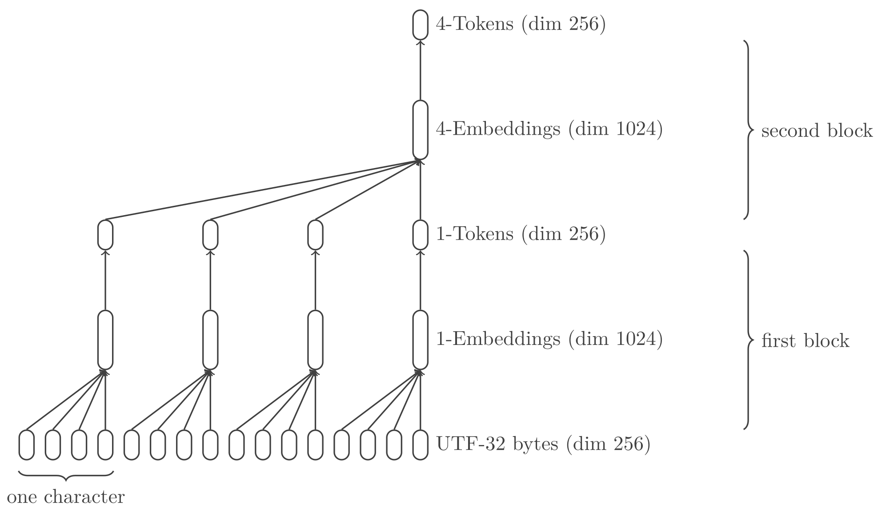

# Tokenization Is A Dead Weight

> `tokun` took tokens to t-can

Current tokenizers have notorious issues that are bringing the LLMs down.

These algortihms follow the human intuition of language to convert text to numbers.
But neural networks have ways to store and process data unlike any interpretable algorithm. 

We will show that a model can be trained to produce a much more efficient text encoding.

Interestingly, this process is different from training a model to understand language:

- the proposed model has a different architecture from transformers
- the best training data is **not** human text but random bytes

Also, the text will be split in chunks of 16 Unicode characters, regardless of the content and meaning.

Obfuscated code, raw HEX or brainf\*ck programming language are all compressed by a factor 16:

| Embedding 1           | Embedding 2           | Embedding 3        |
| --------------------- | --------------------- | ------------------ |
| `$P='++)u){$o.=u)`    | `$t{u)$i}^$k{$j};`    | `}}u)retuu)rn $o;` |
| `0x60806040523480`    | `1561001057600080`    | `fd5b506000805460` |
| `++++++++[>++++[>`    | `++>+++>+++>+<<<<`    | `-]>+>+>->>+[<]<-` |

None of these combinations of characters would ever be made into tokens by traditional tokenizers, especially not of length 16.

## Intuition

OpenAI stated that the [GPT-4 tokens have a length of 4 characters][openai-tokenizer], on average and in English.

With UTF-8, these 4 characters amount to less than 8 bytes in the vast majority of cases.

These 8 bytes are translated into a vector of dimension 100k by a common tokenizer like `cl100`.
If the elements of the vectors are stored as `float32` that's **400k bytes worth of space** for each 4 characters.

Despite tricks and optimizations, there is still a lot of waste in the encoding.
Let's see how it works in detail.

## State Of The Art Tokenization

Suppose you include the following excerpt in a prompt to `GPT-4o`:

```
Une unité lexicale ou token lexical ou plus simplement token est un couple composé d'un nom et d'une valeur optionnelle (e.g. 135677).
```

Since LLMs don't actually handle text, this sentence has first to be translated to numbers.
This process has several stages: encoding, tokenization and embedding.

For now, consider the [end result from the tokenizer `o200k`][tiktokenizer-o200k] (used in `GPT-4o`): 


The sentence is split into chunks called "tokens", which have a 1:1 match with an ID.
Each tokenizer has its own vocabulary and `o200k` contains 200k identified tokens.

These IDs are not yet edible for a NN: AI models digest tensors, which are glorified arrays.
The trick is to interprete each ID as an index in an array of 200k elements:

```
"." => 13 => [0, 0, 0, 0, 0, 0, 0, 0, 0, 0, 0, 0, 0, 1, 0, ..., 0]
```

This operation is called "one-hot encoding".

It turns the orginal prompt in a `(32, 199998)` tensor:
32 ones for each token and 6399904 zeroes.

## Relation With Performances

### Inference

The encoded input has two axes, the dimensions of which have a direct impact on performance.

First, the number of tokens is related to the sequence dimension.
It defines the quantity of information a LLM can process at once.

The prompt of the previous sections had 134 characters, which were reduced to 32 tokens.
It's roughly a compression by a factor 4.

The higher this factor is, the more information the model can fit into a single forward pass / inference.
Conversely, it means that it would take less computing resources to process prompts.

The second axis has a constant dimension of several 100k.
It is directly related to the size of the model, as it will require a neuron for each element.
For example `llama3-8B` has a `128000 x 4096` kernel in its first layer, the embedding, where 128k is the size of the vocabulary.

The size of the model has an overarching impact on the cost.
The number of parameters is roughly a balance between efficiency and quality.

### Model Training

Since tokens are unrelated to each other, LLMs have to see each variation to build relevant embeddings.
Having been trained on `"hot dog"` does not transfer to `"hotdog"`.

The model would not link the two and fail to understand puns that play with ambiguity.
Unless a similar context for the two wordings happens in the training data, which is a lot to ask.

Since `tokun` embeddings hold the information of each character, the two representations will differ only by a space.
LLMs will not need to be trained on each variation, they would understand the nuances natively.

Although I cannot quantify the magnitude, this will lower the volume of data required to build meaningful embeddings (in pretraining).

## Limitations Of Current Tokenizers

This simple example already brings out a number of quirks.
For example, the input tensor is *very* large and mostly zero??

As Andrej Karpathy [pointed out][youtube-karpathy-tokenizer], there are many more:

- [ ] tokenizers are built and operate outside of the NN models
- [ ] they generalize poorly across languages
- [ ] they result in input vectors with dimensions of several 100k
- [ ] they require the definition of additional "special tokens"
- [ ] words out of the vocabulary are fragmented: `["option", "nelle"]`
- [ ] tokens are a priori unrelated to each other:
    - [ ] characters: `"hello"` has no relation to `"h"` or the ASCII code `104`
    - [ ] capitalization: `"New-York"` and `"new-york"`
    - [ ] typos: `"helllo"` and `"hello"`
    - [ ] repetitions: `"    "` and `"\t"`
    - [ ] inflections:
        - conjugation: `"is"` and `"be"`
        - plural: `"languages"` and `"language"`
        - gender: `"franc"` and `"franche"`
        - cases: genetive, nominative, etc
- [ ] words are tokenized differently depending on their surrounding elements:
    - [ ] `"\thello world"` is split into `["\th", "ello", " world"]` by [GPT-4][tiktokenizer-gpt-4]
    - [ ] while `"hello world"` results in `["hello", " world"]`
- [ ] tokenizers have trouble with numbers:
    - [ ] fragmentation: `"8222.3"` is split into `["822", "2", ".", "3"]`
    - [ ] base: `"0x10"` and `"16"`
    - [ ] format: `"1.6e-1"` and `"0.16"`

Obviously I asked `ChatGPT` if he / it / they wanted to add something:

- [ ] dependency on the training data can lead to biases and limit generalization
- [ ] efficiency: some tokenizers can be slow to encode and decode large texts
- [ ] handling of compound words: `"hotdog"` is unrelated to `"hot dog"`

The model `tokun-1` presented here will tackle the first 4 points.
The final model `tokun-4x4` addresses most of these shortcomings.

The serie is heavily focused on western languages, due to personal knowledge.
Still the concepts were tested on asian and middle-eastern languages.

## Proposition

Instead of building vocabularies outside of LLMs, the idea is to train a NN to transform any character sequence into a vector embedding.

The model will learn to compress and decompress text at the same time, *from the raw Unicode bytes*.

Compared to current techniques, both axes will be reduced by several orders:
eventually, the example prompt of 134 characters would be represented as a `(9, 256)` tensor.

## UTF-32 <=> "Better" UTF-8

Just like traditional tokenization, the goal is to compose meaningful tokens from independent bytes.

It starts with the encoding of text characters and symbols, following the [Unicode standard][wiki-unicode].

Usually the translation is performed using UTF, but these schemes do not perfectly fit NN requirements:

| Encoding | Advantages  | Shortcomings |
| ---------| ----------- | ------------ |
| UTF-8    | No gaps     | Varying size |
| UTF-32   | Fixed size  | Null data    |

Having a constant size will allow to split the input text into tensors of fixed shape.

And avoiding null data will help to maximize the information density in the input space.

Actually, we can achieve both goals at once by compressing UTF-32 with a neural network.
This will be the first block layer of the `tokun` model.

## The Model

Overall, the model is a straightforward [variational autoencoder][wiki-vae].

The original [implementation is using Tensorflow][tokun-github], as detailed in the appendices.

### Inputs

The input tensor has shape `(B, S * T, U)`, where:

- `B` is the batch dimension
- `S` is the sequence dimension
- `T` is the token dimension, typically 64
- `U` is the encoding dimension, 256

The original text samples are preprocessed as follows:

- each text sample is padded with `0x00` to a fixed length (on the right)
- then encoded as UTF-32, which means 4 bytes per character
- and finally each byte is represented as a one-hot vector

### Embeddings

The first half of the model, the encoder, turns the inputs into compressed embedding vectors.

Given the input tensor `(B, S * T, U)`, the embeddings have a shape `(B, S, L)`.
`L` is the latent dimension, typically chosen so that `U = L = 256`.

So the encoder divides the sequence length by a factor `T = 64`.
Since the sequence is made of UTF-32 bytes, 4 per character, the text sequence is *compressed 16 times*.

### Outputs

The second half of the model decodes these embeddings back into their constituting bytes.

So, the overall model (encoder + decoder) produces probabilitiy vectors with the same shape as the input.
They can be easily post-processed with `argmax` to predict the actual byte values.

### Architecture

#### Hyper Parameters

- `N = 3`, the number of tokenization blocks
- `G = [4, 4, 4]`, the token unit dimension for each block
- `U = 256`, the encoding dimension from UTF-32-BE
- `E = 256`, the embedding dimension
- `L = 256`, the latent dimension

A priori the dimensions of the last axes could be different.
As we'll see in [the results](#results), these choices seem to fit best.

#### Encoder

The encoder is a CNN, with stacked dilated convolutions similar the the [WaveNet model][arxiv-wavenet].
In the case of a stack of 2 tokenization blocks, the encoding process is:



Each block layer merges the sequence axis chunk by chunk, by a factor $G_i$:

1. the `LayerNorm` layer performs layer normalization
2. the `Reshape` layer splits the sequence axis: `(B, S * G_i, E)` => `(B, S, G_i * E)`
3. the `Dense` layer finally compresses the last dimension `G_i * E` into `E`

With `G = [4, 4, 4]`, the first block merges UTF-32 bytes 4 by 4 and then produces one embedding vector for each Unicode character.
Then the second layer merges the embeddings 4 by 4, etc.

#### Decoder

The decoder performs exactly the reverse operations, with the same token units:

1. the `Dense` layer expands the latent dimension from `E` to `G_i * E`
2. the `Reshape` layer splits the feature axis:  `(B, S, G_i * E)` => `(B, S * G_i, E)`
3. the `LayerNorm` layer performs layer normalization

It is a stack of detokenization layers, decompressing the successive embeddings.

#### Head

The head applies a projection follow by a softmax on the last axis to compute the probability of each byte.

#### Variants

Many variations of the model were trained and compared, with and without :

- normalization, both RMS and layer norm
- attention
- positional embedding
- feed forward layers

Surprisingly, the simplest model performs significantly better.

The only variations of the model are on the token units:

- `[16, 4]` has the best balance between capacity and flexibility
- `[4, 4, 4]` often gets stuck at 75% accuracy but can reach 100% with luck: it is brittle
- `[4, 4]` can be used for extra resilience of the embeddings

## Training

Words, numbers and code amount for a very limited range of the possible combinations of Unicode characters.
And using standard datasets may push the model to emphasize common patterns and undermine unique sequences.

The role of `tokun` is actually to compress the encoding, **not** the language.

So the most significant part is to **train the model on random sequences** of UTF-32-BE bytes.
Since the dataset is random, it can natively scale and there is no need for data augmentation.

Validation was also performed on [MLQA][github-mlqa] to make sure the model keeps its accuracy on regular text.

## Showcase

Before diving into the details of the model, let's see how it handles the prompt:

```
Une unité lexicale ou token lexical ou plus simplement token est un couple composé d'un nom et d'une valeur optionnelle (e.g. 135677).
```

Even though it was not trained on French, the model can encode and decode the sample without errors:

```python
__s = """Une unité lexicale ou token lexical ou plus simplement token est un couple composé d'un nom et d'une valeur optionnelle (e.g. 135677)."""
__x = tokun.pipeline.preprocess(text=__s, groups=N_TOKEN_DIM, flatten=True) # input = UTF-32-BE bytes as one-hot vectors
__e = MODEL._encoder(__x) # embedding = tokens
__p = MODEL._decoder(__e) # output = probabilities for each byte
__y = tokun.pipeline.postprocess(__p) # text = interpreted probabilities
```

```
Une unité lexicale ou token lexical ou plus simplement token est un couple composé d'un nom et d'une valeur optionnelle (e.g. 135677).
Une unité lexicale ou token lexical ou plus simplement token est un couple composé d'un nom et d'une valeur optionnelle (e.g. 135677).��
1.0
```

The variable `__e` is the embedding, the tensor that would be fed to a LLM.
Contrary to traditional tokens, the output of `tokun` is not directly interpretable:

```python
print(len(__s))
# 134
print(__e.shape)
# (34, 256)
tf.print(__e[:4, :8], summarize=-1)
# [[3.17276168 1.53056908 2.41119337 0.0258403085 1.5207386 1.66698301 2.24263883 2.11223722]
#  [2.65205669 1.68546355 2.01416564 0.655108571 2.3957293 1.70228446 2.12328672 2.04205203]
#  [2.4943645 0.441500723 1.79073346 2.31724644 1.87132716 1.36434507 3.37104845 2.3522613]
#  [2.87078524 1.11898732 2.12827492 0.995271683 0.403087556 0.974042118 1.82035911 2.90426946]]
```

Still, the vectors / tokens can be mapped to 3D and understood to some extent:

| Accents                       | Symbols                       |
| ----------------------------- | ----------------------------- |
| ![][image-tsne-token-accents] | ![][image-tsne-token-symbols] |

The images above are 2 views from the UMAP plot of embeddings.
These embeddings are the representation of the French page on [VAE models][wiki-vae-fr].

On the right, the selected point is labeled `"𝑞\nΦ\n"`, it is the embedding for a portion of a LaTeX equation.
Inded, the input was a raw copy-paste of the article so the equation symbols were spread across several lines:

```latex
{\displaystyle p_{\theta }(\mathbf {x} )=\int _{\mathbf {z} }p_{\theta }(\mathbf {x,z} )\,d\mathbf {z} ,}
où 
𝑝
𝜃
(
𝑥
,
𝑧
)
```

Hence the newlines `"\n"` in the labels.

Despite the quirks of the inputs, `tokun-4` decodes the embeddings with 99% accuracy, only missing a few Greek symbols in the equations.

It was not trained on any code, French nor Greek: it is performing well across languages.
In any case, the few errors should be easily remediated with a more complete training dataset.

Also the latent space shows structure: the model has learnt the Unicode scheme and more than 7 languages.

### Limit / Locality / Robustness

With `tokun-16`, the model is getting one step closer to the limit of input compression.

16 Unicode characters will be represented by a `float32` vector of dimension 256.
It's 1024 output bytes for every 64 input bytes.

It would appear that there is still a lot of leeway.
Actually, if there was a 1:1 match it would mean that only a single embedding value would map to each token.

It would be impractical since it would require LLMs to predict very precise values.
Suppose that `[0.025 1.52 1.67 2.24 ...]` represents `"hello world! \o/"`.
If the LLM outputs `[0.025 1.53 1.67 2.24 ...]` it may just have produced a totally random string.

In fact, $\frac{1024}{64} = 16$ is a good ratio:
we want each chunk of 16 characters to be represented by a region in the space of dimension 256.

Ultimately, we would like to map the entire Unicode space.
In theory, Unicode is made of $2^32$ code points.

However only [17 Unicode planes][wiki-unicode-plane] are used because of the limitations.
Out of those 17 planes only 7 are actually used, with 2 reserved for user customization (think empty).

So our final goal is only to map 327,680 code points.

## Conclusion

Until now, LLMs learnt to understand the language in the pretraining phase.
Then to understand human interactions or other tasks in the fine-tuning phase.
And finally were taught to behave according to policies.

Here, we argued that neural networks can learn to encode and decode text to better fit their needs.

These processes require specific architectures and data.
Just like in regular programming languages, neural modules are being built.

Machine learning is actually reminiscent of HTML and declarative programming languages:
instead of specifying the process that NN have to follow the properties of the result are shown through data.

Rather than refering to vague, manipulative and emotionally charged notions like "AGI", this field would benefit from being standardized and rationalized like a new programming language.

## Resources


[arxiv-wavenet]: https://arxiv.org/pdf/1609.03499.pdf
[github-mlqa]: https://github.com/facebookresearch/MLQA
[openai-tokenizer]: https://platform.openai.com/tokenizer
[tensorboard-projector]: https://projector.tensorflow.org/
[tiktokenizer-gpt-4]: https://tiktokenizer.vercel.app/?model=gpt-4
[tiktokenizer-o200k]: https://tiktokenizer.vercel.app/?model=o200k_base
[unicode-table]: https://symbl.cc/en/unicode-table/

[youtube-karpathy-tokenizer]: https://www.youtube.com/watch?v=zduSFxRajkE

[tokun-articles]: https://github.com/apehex/tokun/tree/main/articles
[tokun-colab]: https://colab.research.google.com/github/apehex/tokun/blob/main/notebooks/tokun.model.ipynb
[tokun-github]: https://github.com/apehex/tokun
[tokun-notebooks]: https://github.com/apehex/tokun/tree/main/notebooks

[wiki-unicode]: https://en.wikipedia.org/wiki/Unicode
[wiki-vae]: https://en.wikipedia.org/wiki/Variational_autoencoder
[wiki-tsne]: https://en.wikipedia.org/wiki/T-distributed_stochastic_neighbor_embedding

