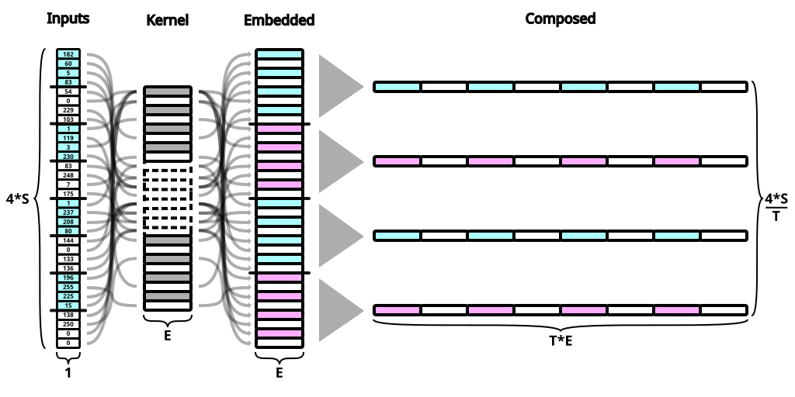
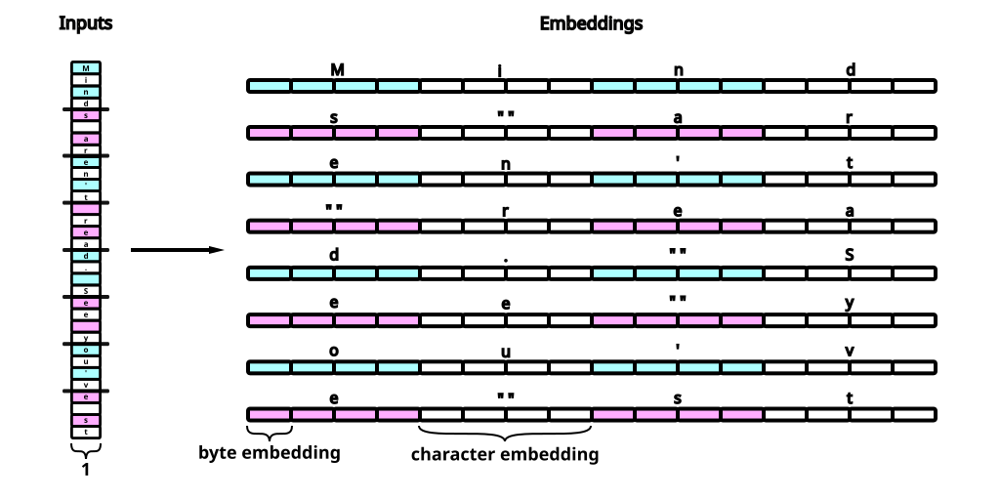
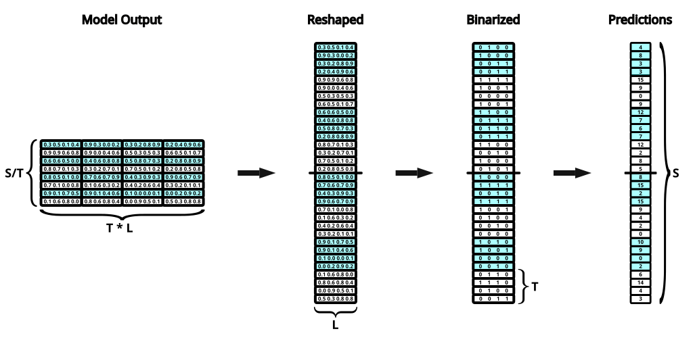
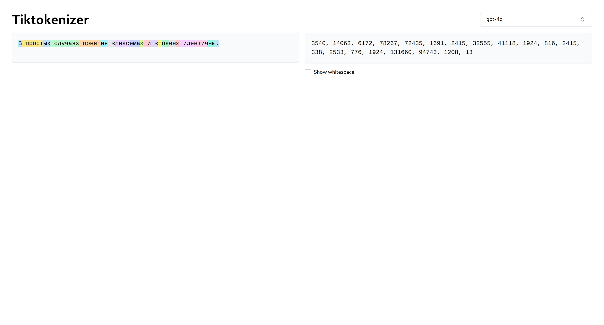

# This Title Is Already Tokenized (Tokun Part 2)


In machine learning, three domains —computer science, mathematics, and linguistics— are often at odds.

Each domain handles text in a different form:

- computers deal with raw numbers like byte sequences
- mathematics manipulates tensors and vector
- while linguistics focuses on graphemes (characters) and their combinations (words)

Tokenization has long been used as a bridge, transforming human-readable text into a machine-friendly format.
It relies on algorithms like [BPE][wikipedia-bpe], which draw on human intuition.

In my [previous article][huggingface-tokenization-1], I proposed to let the model itself learn the mapping from raw bytes to embeddings.

However, there's a more straightforward alternative: using Unicode directly as the foundation for embeddings in LLMs.

## TL;DR

Rather than merging encoding bytes outside of the model (BPE, etc), the idea is to **combine elementary embeddings inside the model**.

It can be achieved with small changes to the transformer architecture, on the input and output layers.

### Input Pipeline

The inputs are processed as follows:

- the text is encoded using UTF-32-BE into a sequence of bytes (values in `[0 .. 256[`)
- each byte is embedded independently using a `(256, E)` kernel
- the byte embeddings are merged by groups of size `T`

Starting from the UTF-32-BE bytes, and with `T = 2`:



`T` and `E` can be **chosen freely**: the token length could be 4, 8 or even 16.
With a matching embedding dimension for the bytes, `T * E` is brought to the model dimension, say 4096.

The bytes can be given independent meaning thanks to the embedding table.
Each one contributes to a specific portion of the final embedding:



And the overall combination pattern holds the information on token composition.

### Output Pipeline

The output layer could be a standard softmax of depth 256 for each byte prediction.

But, instead of evaluating each of the 256 options, it is more efficient to **predict the value, as a vector of 8 bits**:



The head activation is replaced with a sigmoid, which returns an independent probability for each bit.

### Advantages

Just [like the previous iteration of tokun](tokun.md) this scheme solves most tokenization shortcomings.
Plus:

- **token length**: the token length can be freely chosen, it is **now a hyper-parameter**
- **straightforward**: there is no need for extra preprocessing or training
- **optimizations** (minor): the kernels of the input and output layers are smaller
- **correlation**: there is a direct match between predictions and text composition

You'll find more details in the [comparison section](#comparison-with-tokenization).

In particular, the last point has wide ranging implications:
for example, digits are encoded as `48 + d` in Unicode, hence number representation is shifted but preserved.

## TOC

- [Tokenization And Ancient Language](#tokenization-and-ancient-languages)
- [Unicode Embeddings](#codepoint-embeddings)
    - [Codepoint Embeddings](#codepoint-embeddings)
    - [Byte Embeddings](#byte-embeddings)
- [Composite Embeddings](#composite-embeddings)
- [Binary Predictions](#binary-predictions)
- [Comparison With Tokenization](#comparison-with-tokenization)
    - [Meta Parameters](#meta-parameters)
    - [Training](#training)
    - [Consistency](#consistency)
    - [Compression](#compression)
        - [Weights](#weights)
        - [Inputs](#inputs)
        - [Outputs](#outputs)
    - [Prediction Errors](#prediction-errors)
- [Implementations](#implementation)
    - [Composite Embeddings](#composite-embeddings)
    - [Binary Predictions](#binary-predictions)
- [Next](#next)

## Tokenization And Ancient Languages

Essentially, tokenization merges individual characters (bytes) into **monolithic chunks**.
Here, 56 cyrillic characters are grouped into 20 tokens:



LLMs are only aware of the index values on the right side and lose the information on token composition.

Imagine using a [unique symbol for every number and word variation][twitter-karpathy-emojis]!

The early written languages like hieroglyphs started with such logograms, but they still had rebus rules to form nuanced meanings out of combinations of symbols.

For example the plural form is obtained by tripling a logogram or adding 3 bars next to it:
"house" is "𓉐" and "houses" is "𓉐 𓏪".

Meanwhile o200k has " house" (4276), " House" (7826), "house" (9983), " houses" (20327), "House" (27796), "-house" (46400) etc.

Most modern languages developped rules to derive new meanings from **combinations of symbols**.

In particular, phonetic and positional systems allow to compose words and numbers.
And the composition of a word gives many indications on its meaning.

In all three domains mentioned earlier, macro elements break down into simpler parts.
For text, the different scales are roughly:

- computer science: sequences => codepoints => bytes => bits
- mathematics: tensors => axes => dimensions
- linguistics: paragraphs => sentences => words => symbols / letters

Tokenization cuts the decomposition short: it stops between sequences and codepoints on the computer side, which is somewhere between sentences and graphemes for linguistics.

On the contrary, the Unicode standard indexes 149813 symbols.
They can be used to compose all the words from modern languages.

It will be the language basis for the LLM embeddings.

## Unicode Embeddings

BPE stands for Byte Pair Encoding: it generates numbers to index specific tuples of characters.

Still, after several generations of encodings, computer scientists have formed an international standard: the Unicode.
Is BPE really necessary, let alone useful?

### Codepoint Embeddings

Each token index ino200k is equivalent to the underlying sequence of Unicode codepoints.
The latter is actually a new composite index that is more informative:

| Position      | Token         | o200k     | UTF-32-BE                                 |
| ------------- | ------------- | --------- | ----------------------------------------- |
| 0             | `M`           | `44`      | `(77)`                                    |
| 1             | `inds`        | `13834`   | `(105, 110, 100, 115)`                    |
| 2             | ` aren't`     | `23236`   | `(32, 97, 114, 101, 110, 39, 116)`        |
| 3             | ` read`       | `1729`    | `(32, 114, 101, 97, 100)`                 |
| 4             | `.`           | `13`      | `(46)`                                    |
| ...           | ...           | ...       | ...                                       |

Now that all the indexes are Unicode, there is no reason to keep the uneven chunks:

| Position  | Chunk         | UTF-32-BE             | Embeddings                                            |
| --------- | ------------- | --------------------- | ----------------------------------------------------- |
| 0         | `Mind`        | `(77, 105, 110, 100)` | `(0.00029373, 0.00040054, 0.00041962, 0.00038147)`    |
| 1         | `s ar`        | `(115, 32, 97, 114)`  | `(0.00043869, 0.00012207, 0.00037003, 0.00043488)`    |
| 2         | `en't`        | `(101, 110, 39, 116)` | `(0.00038528, 0.00041962, 0.00014877, 0.0004425 )`    |
| 3         | ` rea`        | `(32, 114, 101, 97)`  | `(0.00012207, 0.00043488, 0.00038528, 0.00037003)`    |
| ...       | ...           | ...                   | ...                                                   |

This operation might look banal, but we moved data **from the sequence axis to the feature axis**!
Now, the table is looking like an actual embedding tensor!

After normalizing the values, the codepoints can be directly treated as embeddings.
And the "tokens" can be made arbitrarily long:

| Position  | Chunk             | UTF-32-BE                                 | Embeddings                                                                    |
| --------- | ----------------- | ----------------------------------------- | ----------------------------------------------------------------------------- |
| 0         | `Minds ar`        | `(77, 105, 110, 100, 115, 32, 97, 114)`   | `(2.94e-4, 4.01e-4, 4.20e-4, 3.81e-4, 4.39e-4, 1.22e-4, 3.70e-4, 4.35e-4)`    |
| 1         | `en't rea`        | `(101, 110, 39, 116, 32, 114, 101, 97)`   | `(3.85e-4, 4.20e-4, 1.49e-4, 4.43e-4, 1.22e-4, 4.35e-4, 3.85e-4, 3.70e-4)`    |
| ...       | ...               | ...                                       | ...                                                                           |

Now the length of the sequence chunks ("tokens") is a hyper-parameter like the number of layers in a model.

These vectors have a lot of information embedded.
Dimensionality reduction shows how the vectors made from similar characters are close:

| PCA                       | UMAP                         |
| ------------------------- | ---------------------------- |
| ![][image-pca-codepoints] | ![][image-umap-codepoints]   |

Since the standard defines the Unicode space into themed ranges of values, the embeddings are natively correlated with content.
For example there are regions for each character set (Latin, Cyrillic, etc), for emojis, for symbols, for special characters, etc.

For more informations see:

- the Wikipedia article on [Unicode planes][wikipedia-unicode-planes]
- the Unicode table at [symbl.cc][symbl-blocks]

These normalized embeddings can serve as input tensor for a LLM.
The model can then extend the embedding dimension for further processing.

This scheme inherits from the properties of Unicode and has already most of the advantages [listed in the TL;DR](#tl-dr).

Still, there is a lot to improve too:

- brittle: the embedding values are very precise and they are separated by `1 / 0x40000 = 3.8147-06` only
- linearity: the embeddings are regularly spaced even though certain codepoints have very different meanings from their neighbors
- size: there are 262144 "basic" elements, which is *not* an improvement over regular vocabularies

### Byte Embeddings

Unicode codepoints can be split further into bytes:

| Position  | Chunk         | UTF-32-BE                                                     | Embeddings                                                                |
| --------- | ------------- | ------------------------------------------------------------- | ------------------------------------------------------------------------- |
| 0         | `Mind`        | `(0, 0, 0,  77, 0, 0, 0, 105, 0, 0, 0, 110, 0, 0, 0, 100)`    | `(0 0 0 0.30078125 0 0 0 0.41015625 0 0 0 0.4296875 0 0 0 0.390625)`      |
| 1         | `s ar`        | `(0, 0, 0, 115, 0, 0, 0,  32, 0, 0, 0,  97, 0, 0, 0, 114)`    | `(0 0 0 0.44921875 0 0 0 0.125 0 0 0 0.37890625 0 0 0 0.4453125)`         |
| 2         | `en't`        | `(0, 0, 0, 101, 0, 0, 0, 110, 0, 0, 0,  39, 0, 0, 0, 116)`    | `(0 0 0 0.39453125 0 0 0 0.4296875 0 0 0 0.15234375 0 0 0 0.453125)`      |
| 3         | ` rea`        | `(0, 0, 0,  32, 0, 0, 0, 114, 0, 0, 0, 101, 0, 0, 0,  97)`    | `(0 0 0 0.125 0 0 0 0.4453125 0 0 0 0.39453125 0 0 0 0.37890625)`         |
| ...       | ...           | ...                                                           | ...                                                                       |

There are a lot of zeros because all the characters from the example come from the ASCII table, which is right at the start of the Unicode table.
For example "Unicode" is "유니코드" in Korean which is encoded as `(0, 0, 199, 32, 0, 0, 178, 200, 0, 0, 207, 84, 0, 0, 180, 220)` in UTF-32-BE.

Rather than dividing by `0x40000`, each byte can be normalized by `256`.

The structure of Unicode is even more apparent with these embeddings:

| PCA                  | UMAP                   |
| -------------------- | ---------------------- |
| ![][image-pca-bytes] | ![][image-umap-bytes]  |

This transformation solves 2 of the shortcomings of the previous method:

- embeddings are composed from 256 base elements rather than 200k
- there is more separation between values

Still, the embeddings are lineary distributed.
It would be better to distinguish special values, in particular the null byte.

Traditional embeddings are totally independent and arbitrary.
Could this feature be mixed with base decomposition?

## Composite Embeddings

The previous embedding mapped each byte with its value divided by 256.

Actually, the integer bytes can be interpreted as an index in a traditional embedding layer.
After concatening the embeddings from each byte, a "token" embedding is formed:


Even with random vectors for each byte, the merged embeddings keep the information on token composition:

| PCA                       | UMAP                          |
| ------------------------- | ----------------------------- |
| ![][image-pca-composite]  | ![][image-umap-composite]     |

Now, the "token" length is **a hyper-parameter of the model**.
For example, the Gemma2-27B architecture could be tweaked like this:

- the embed dimension `E` is kept at 4608
- the token dimension `T` is set to 64 (bytes, which amount to 16 Unicode characters)
- the byte dimension `C` is then 4608 / 64 = 72
- the context dimension `S` and all other values remain the same

Then an input tensor with a batch dimension `B` of 128 and sequence dimension of 16384 (4096 characters) would be:

- first reshaped as `(B, S / T, T) = (128, 256, 64)`
- and exit the composite embedding layer as a tensor of shape `(B, S / T, T * C) = (128, 256, 4608)`

The LLM would process the input as a sequence of 256 embeddings, each representing 16 characters.
And each of these embeddings is actually made from the concatenation of 64 byte embeddings.

This layer can then be trained and the embeddings for each byte can be adjusted by the model.
It allows the model to set an independent meaning to each byte, contrary to the two schemes in the sections above.

Now the LLM knows the composition of each token.
It can natively perform calculations, create and understand neologisms, etc.

## Binary Predictions

Since the format of the inputs changed, the targets should have a matching representation.

Let's get back to the current models (2024) and suppose GPT-4o processed the following sentence:

```
This paper was based mainly on the attention mechanism developed by Bahdanau et al. in 2014.[11]
```

For each position in the sequence, the model evaluates the probability of every single token.

Given everything before the token "201" the probability vector might look like this:

| Index         | 0     | ...   | 290       | ...   | 667   | ...   | 1179  | ...   | 1323  | ...   | 34902         | ...   | 199,997   |
| ------------- | ----- | ----- | --------- | ----- | ----- | ----- | ----- | ----- | ----- | ----- | ------------- | ----- | --------- |
| Token         | `!`   | ...   | ` the`    | ...   | `201` | ...   | `200` | ...   | `202` | ...   | ` september`  | ...   | ` cocos`  |
| Target        | 0     | ...   | 0         | ...   | 1     | ...   | 0     | ...   | 0     | ...   | 0             | ...   | 0         |
| Prediction    | 0     | ...   | 0.15      | ...   | 0.4   | ...   | 0.1   | ...   | 0.25  | ...   | 0.08          | ...   | 0         |

This one-hot vector has a **dimension of 200k** and is usually obtained with either:

- a softmax activation
- dot projection on the embedding vectors

Instead, every number below 200k can be represented with **just 18 bits**.
The target index `667` for the next token "201" is `110110010100000000` in base 2.

Each bit can be predicted by an **independent probability** by switching the activation from softmax to a **sigmoid**:

| Index         | 0     | 1     | 2     | 3     | 4     | 5     | 6     | 7     | 8     | 9     | 10    | 11    | 12    | 13    | 14    | 15    | 16    | 17    |
| ------------- | ----- | ----- | ----- | ----- | ----- | ----- | ----- | ----- | ----- | ----- | ----- | ----- | ----- | ----- | ----- | ----- | ----- | ----- |
| Target        | 1     | 1     | 0     | 1     | 1     | 0     | 0     | 1     | 0     | 1     | 0     | 0     | 0     | 0     | 0     | 0     | 0     | 0     |
| Prediction    | 0.6   | 0.58  | 0.55  | 0.7   | 0.64  | 0.37  | 0.2   | 0.8   | 0.25  | 0.9   | 0.08  | 0.12  | 0.04  | 0.1   | 0.02  | 0     | 0     | 0     |

The binary vector above encodes the prediction "671": 
With this output scheme, prediction errors are numerically close, because each bit only contributes to a portion of the prediction.

Unfortunately, the vocabulary of tokenizers are chaotic: **numeric proximity** is unrelated to **semantic similarity**.
For example, the tokens surrounding "201" in o200k are: " can", "п", " me", " с", b"\xe0\xb3".

Now that the representation of the predictions is improved, it is time to address *what* is being predicted.

## Comparison With Tokenization

The hyper parameters are set for all the comparisons below:

- the reference tokenizer is o200k
- batch dimension: `B = 128`
- sequence dimension: `S = 32,768` characters
- token dimension: `T = 64`
- embedding dimensions:
    - for each byte: `E = 64`
    - inside the model: `H = 4096`

### Meta-Parameters

While the length is highly variable from token to token in a traditional tokenizer, it is now fixed.

Rather than being the product the vocabulary size and training data, **the token length is now a choice**.

For the purpose of this comparison, I chose 16 (64 bytes) as token dimension.
Depending on the model architecture, the task and localization, this hyper-parameter can be adjusted **to optimize performances**.

### Training

There is no vocabulary to gather, so:

- there is **no training step**
- the process **doesn't change with time**, while word frequencies vary and vocabularies grow

### Consistency

Token sizes are irregular, while UTF-32-BE allows to group bytes into fixed size chunks.

Since the Unicode standard covers all modern languages, this group size is always the same, regardless of the underlying script.

### Compression

#### Weights

The embedding kernel has a shape `(256, E)`, here `(256, 64)`.
In contrast, the kernel for the vocabulary o200k is `(199998, H)`, which is `(199998, 4096)`.

The latter kernel requires enormous amounts of data so that each token in the vocabulary is witnessed in several contexts.
On the contrary, all the byte values are seen in countless combinations, each will get a solid training.

Similarly, the projection layers have are shaped:

- `(199998, H) = (199998, 4096)` in case of a dot-product and the transpose for a softmax head
- `(H, 8 * T) = (4096, 512)` with the sigmoid activation for binary predictions

In short, kernels are 50000 and 400 times smaller with composite embeddings and binary predictions.

#### Inputs

The sequence dimension `S = 32,768` leads to:

- a context dimension of `C = 8,192` with tokenization (on average, with o200k, for the purpose of comparing)
- a sequence of `4 * S = 131,072` bytes

After embedding, the input tensors are:

- `(8192, 4096)` with tokenization
- `(4 * S / T, 4096) = (2048, 4096)` with composite embeddings

The composite embeddings are a combination of `T = 64` vectors of dimension `E = 64` for a total of 4096.

While UTF-32 temporarily expands the input sequence, it is then reduced into a smaller tensor.

#### Outputs

As for the outputs, they are:

- `(8192, 199998)` with tokenization
- `(4 * S / T, 8 * T) = (2048, 512)` with binary predictions

Binary prediction 1600 times smaller and very dense in comparison.

### Prediction Errors

With tokenization:

- a prediction is a whole subword, taken from a vocabulary
- tokens are listed in a chaotic order, and neighbors are unrelated
- the numeric error spans the whole output dimension (vocabulary size)

With binary predictions:

- the next chunk of text is predicted one byte at a time
- bytes are ordered according to the Unicode std, which is very structured
- each prediction bit contributes to a portion of the prediction / error

So if the next token was `e`, the target would be:

- a one-hot vector with a 1 at index `327`, for a model with tokenizer (199997 zeros and a one)
- `(0, 0, 0, 101)` or `((0, 0, 0, 0, 0, 0, 0, 0), (0, 0, 0, 0, 0, 0, 0, 0), (0, 0, 0, 0, 0, 0, 0, 0), (0, 1, 1, 0, 0, 1, 0, 1))` in binary

And a wrong prediction would be respectively:

- index 328 or ` of`
- `((0, 0, 0, 0, 0, 0, 0, 0), (0, 0, 0, 0, 0, 0, 0, 0), (0, 0, 0, 0, 0, 0, 0, 0), (0, 1, 1, 0, 0, 1, 1, 1))` or `(0, 0, 0, 103)` for `g`

From my experience the model rarely fails to predict the null bytes (even with a class weights `0.3`).

To sum up:

- the errors on token predictions are random
- binary errors are in the neighborhood of the target, which means that it is similar thanks to Unicode
- token predictions are always meaningful subwords
- while byte level predictions can have "typos" in the middle

So there are pros and cons to both approaches.

## Implementations

### Composite Embeddings

The composite embeddings can be implemented in a very simple layer.
For example, in Keras:

```python
@keras.saving.register_keras_serializable(package='layers')
class TokunEmbedding(keras.layers.Embedding):
    def call(self, inputs: keras.Input) -> keras.Input:
        # embed each element separately
        __outputs = super(TokunEmbedding, self).call(inputs)
        # concatenate the embeddings
        return keras.ops.einsum('bste -> bs(te)', __outputs)
```

Or in PyTorch:

```python
class TokunEmbedding(torch.nn.Embedding):
    def forward(self, inputs: torch.Tensor) -> torch.Tensor:
        # embed each element separately
        __outputs = super(TokunEmbedding, self).forward(inputs)
        # concatenate the embeddings
        return torch.einsum('bste -> bs(te)', __outputs)
```

The `einsum` operation could be replaced with a more generic "merge" operation independent of the rank of its input.
For example, the `einsum` equation could be generated according to the rank of the input:

```python
def _equation(self, inputs: keras.Input) -> str:
    __rank = len(keras.ops.shape(inputs))
    __indices = [chr(97 + __i) for __i in range(__rank + 1)] # embedding adds an axis
    return '{} -> {}({})'.format(''.join(__indices), ''.join(__indices[:-2]), ''.join(__indices[-2:]))
```

### Binary Predictions

The targets for the binary predictions are calculated by decomposing the inputs in base 2.
For example in Tensorflow:

```python
def expand_base(data: tf.Tensor, base: int, depth: int, bigendian: bool=True) -> tf.Tensor:
    __shape = len(list(data.shape)) * [1] + [depth]
    # base indexes
    __idx = range(depth)[::-1] if bigendian else range(depth)
    # base divisor and moduli
    __div = tf.convert_to_tensor([base ** __e for __e in __idx], dtype=data.dtype)
    __mod = tf.convert_to_tensor([base ** (__e + 1) for __e in __idx], dtype=data.dtype)
    # match the input shape
    __div = tf.reshape(__div, shape=__shape)
    __mod = tf.reshape(__mod, shape=__shape)
    # Euclidean algorithm
    __digits = tf.math.floordiv(x=tf.math.floormod(x=tf.expand_dims(data, axis=-1), y=__mod), y=__div)
    # format
    return tf.cast(__digits, dtype=data.dtype)
```

In PyTorch:

```python
def expand_base(data: torch.Tensor, base: int, depth: int, bigendian: bool=True) -> torch.Tensor:
    __shape = data.dim() * [1] + [depth]
    # base indexes
    __idx = range(depth)[::-1] if bigendian else range(depth)
    # base divisors and moduli
    __div = torch.tensor([base ** __e for __e in __idx], dtype=data.dtype, device=data.device)
    __mod = torch.tensor([base ** (__e + 1) for __e in __idx], dtype=data.dtype, device=data.device)
    # match the input shape
    __div = __div.view(__shape)
    __mod = __mod.view(__shape)
    # Euclidean algorithm
    __digits = torch.div(torch.remainder(data.unsqueeze(-1), __mod), __div, rounding_mode='floor')
    # format
    return __digits.to(data.dtype)
```

During inference, the predictions can be interpreted by doing the reverse operation:

```python
def reduce_base(data: tf.Tensor, base: int, axis: int=-1, keepdims: bool=False, bigendian: bool=True) -> tf.Tensor:
    __rank = len(data.shape)
    # select the dimension of the given axis
    __shape = [__d if (__i - axis) % __rank == 0 else 1 for __i, __d in enumerate(list(data.shape))]
    # exponents
    __exp = range(__shape[axis])[::-1] if bigendian else range(__shape[axis])
    # base multipliers
    __base = tf.convert_to_tensor([base ** __e for __e in __exp], dtype=data.dtype)
    # match the input shape
    __base = tf.reshape(__base, shape=__shape)
    # recompose the number
    return tf.reduce_sum(data * __base, axis=axis, keepdims=keepdims)
```

Or, in PyTorch:

```python
def reduce_base(data: torch.Tensor, base: int, axis: int=-1, keepdims: bool=False, bigendian: bool=True) -> torch.Tensor:
    __rank = len(data.shape)
    # select the dimension of the given axis
    __shape = [__d if (__i - axis) % __rank == 0 else 1 for __i, __d in enumerate(list(data.shape))]
    # exponents
    __exp = torch.arange(__shape[axis] - 1, -1, -1) if bigendian else torch.arange(__shape[axis])
    # base multipliers
    __base = torch.pow(base, __exp).to(data.device).to(data.dtype)
    # match the input shape
    __base = __base.view(__shape)
    # Recompose the number
    return torch.sum(data * __base, dim=axis, keepdim=keepdims)
```

## Next

With this, LLMs can parse inputs up to the byte level, allowing:

- number calculations
- handling rare words
- 

LLMs are still in the stone age

compiler + llm using tokun embeddings

composition <=> embeddings
weaker form of semantic similarity => improved?

can these embedding and prediction techniques be further improved?

obviously this research of western centric, because of my limited knowledge.
I'd be interested to have other POV, don't hesitate to reach out :)

## Resources

Reference implementations:

- in Tensorflow + Keras: [mlable PyPi package][pypi-mlable]
- in PyTorch: notebook in a [fork of GPT2 by Mr Karpathy][github-gpt2]

[image-pca-bytes]: .images/projector/bytes.pca.gif
[image-umap-bytes]: .images/projector/bytes.umap.gif
[image-pca-codepoints]: .images/projector/codes.pca.gif
[image-umap-codepoints]: .images/projector/codes.umap.gif
[image-pca-composite]: .images/projector/compo.pca.gif
[image-umap-composite]: .images/projector/compo.umap.gif

[github-gpt2]: https://github.com/apehex/gpt2
[huggingface-tokenization-1]: https://huggingface.co/blog/apehex/tokenization-is-a-dead-weight
[pypi-mlable]: https://pypi.org/project/mlable/
[symbl-blocks]: https://symbl.cc/en/unicode/blocks/
[tiktokenizer-gpt-4]: https://tiktokenizer.vercel.app/?model=gpt-4
[twitter-karpathy-emojis]: https://x.com/karpathy/status/1816637781659254908
[wikipedia-bpe]: https://en.wikipedia.org/wiki/Byte_pair_encoding
[wikipedia-unicode-planes]: https://en.wikipedia.org/wiki/Plane_(Unicode)
