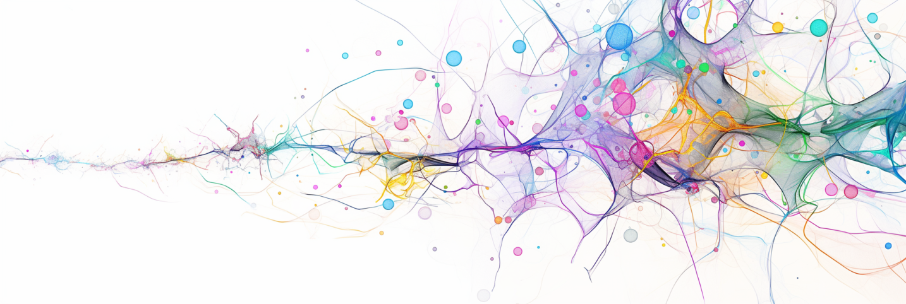

# This Title Is Already Tokenized

unicode is all you need
ai encoding uses language from -1000
from hieroglyphs to 
back from the prehistoric ages
this title is already tokenized

> `tokun` took tokens to t-can

in machine learning 3 worlds / visions are at odds: the computer, math and human sides.

tokenization bridges the gap from machine to tensors using human intuition, with algorithms like BPE.

in my [previous article][huggingface-tokenization-1], I proposed to train a model to translate / compress the encoding bytes into embeddings.

Actually, none of this is necessary since any digital text has already an encoding which can directly be used as embedding.

from encoding to embedding

## TLDR

=> composite embeddings in the last section

INPUT = composite embeddings =
- sequence compression by arbitrary factor
- numeric proximity <=> semantic similarity

- arbitrary token length: hyper-parameter

OUTPUT = binary predictions leverage the numeric locality != categorical (softmax) predictions




## Intuition

Russian translation of `In simple cases, the concepts of "lexeme" and "token" are identical`:

```
В простых случаях понятия «лексема» и «токен» идентичны.
```

56 UTF-32 codepoints:

```
[1042, 32, 1087, 1088, 1086, 1089, 1090, 1099, 1093, 32, 1089, 1083, 1091, 1095, 1072, 1103, 1093, 32, 1087, 1086, 1085, 1103, 1090, 1080, 1103, 32, 171, 1083, 1077, 1082, 1089, 1077, 1084, 1072, 187, 32, 1080, 32, 171, 1090, 1086, 1082, 1077, 1085, 187, 32, 1080, 1076, 1077, 1085, 1090, 1080, 1095, 1085, 1099, 46]
```

224 UTF-32-BE bytes:

```
[0, 0, 4, 18, 0, 0, 0, 32, 0, 0, 4, 63, 0, 0, 4, 64, 0, 0, 4, 62, 0, 0, 4, 65, 0, 0, 4, 66, 0, 0, 4, 75, 0, 0, 4, 69, 0, 0, 0, 32, 0, 0, 4, 65, 0, 0, 4, 59, 0, 0, 4, 67, 0, 0, 4, 71, 0, 0, 4, 48, 0, 0, 4, 79, 0, 0, 4, 69, 0, 0, 0, 32, 0, 0, 4, 63, 0, 0, 4, 62, 0, 0, 4, 61, 0, 0, 4, 79, 0, 0, 4, 66, 0, 0, 4, 56, 0, 0, 4, 79, 0, 0, 0, 32, 0, 0, 0, 171, 0, 0, 4, 59, 0, 0, 4, 53, 0, 0, 4, 58, 0, 0, 4, 65, 0, 0, 4, 53, 0, 0, 4, 60, 0, 0, 4, 48, 0, 0, 0, 187, 0, 0, 0, 32, 0, 0, 4, 56, 0, 0, 0, 32, 0, 0, 0, 171, 0, 0, 4, 66, 0, 0, 4, 62, 0, 0, 4, 58, 0, 0, 4, 53, 0, 0, 4, 61, 0, 0, 0, 187, 0, 0, 0, 32, 0, 0, 4, 56, 0, 0, 4, 52, 0, 0, 4, 53, 0, 0, 4, 61, 0, 0, 4, 66, 0, 0, 4, 56, 0, 0, 4, 71, 0, 0, 4, 61, 0, 0, 4, 75, 0, 0, 0, 46]
```

## Notice

will start with specific issues and progressively build a new system. 

In the following sections, I have minimized the interface of [Tiktokenizer][tiktokenizer-gpt-4], but the data is still accurate.

western language
interested on perspective other culture / continent

## Tokenization And Ancient Languages

essentially, tokenization merges individual characters (bytes) into monolithic tokens.
here, the 56 cyrillic characters are grouped into 20 tokens:


LLMs are only aware of the index values on the right and lose the information on token composition.
Our numbers are all composed of the same 10 digits; imagine having [a different symbol for each number][twitter-karpathy-emojis]!

The early written languages like hieroglyphs
They further developped
Ancient languages like Egyptian had 
Such schemes are called logographic languages
most languages evolved from this stage

compose from simpler elements
=> alphabetic and syllabic

Most modern languages have composition rules

more generally this is the concept of 

humans can't remember a million symbols and machines would like to avoid wasting resources on BS
(mindful)

## Representing The Predictions

Suppose GPT-4o processed the following sentence:

```
This paper was based mainly on the attention mechanism developed by Bahdanau et al. in 2014.[11]
```

For each position in the sequence, the model outputs a vector of probabilities for the next token.
Given every before, the prediction for the token "201" might look like this:

| Index         | 0     | ...   | 290   | ...   | 667   | ...   | 1179  | ...   | 1323  | ...   | 34902         | ...   | 199,997   |
| ------------- | ----- | ----- | ----- | ----- | ----- | ----- | ----- | ----- | ----- | ----- | ------------- | ----- | --------- |
| Token         | "!"   | ...   | the   | ...   | 201   | ...   | 200   | ...   | 202   | ...   | " september"  | ...   | " cocos"  |
| Target        | 0     | ...   | 0     | ...   | 1     | ...   | 0     | ...   | 0     | ...   | 0             | ...   | 0         |
| Prediction    | 0     | ...   | 0.15  | ...   | 0.4   | ...   | 0.1   | ...   | 0.25  | ...   | 0.08          | ...   | 0         |

This one-hot vector has a dimension of 200k and is usually obtained with softmax

instead, every number below 200k can be represented with just 18 bits.
switching the activation from softmax to a sigmoid:

| Index         | 0     | 1     | 2     | 3     | 4     | 5     | 6     | 7     | 8     | 9     | 10    | 11    | 12    | 13    | 14    | 15    | 16    | 17    |
| ------------- | ----- | ----- | ----- | ----- | ----- | ----- | ----- | ----- | ----- | ----- | ----- | ----- | ----- | ----- | ----- | ----- | ----- | ----- |
| Target        | 1     | 1     | 0     | 1     | 1     | 0     | 0     | 1     | 0     | 1     | 0     | 0     | 0     | 0     | 0     | 0     | 0     | 0     |
| Prediction    | 0.6   | 0.58  | 0.55  | 0.7   | 0.64  | 0.37  | 0.2   | 0.8   | 0.25  | 0.9   | 0.08  | 0.12  | 0.04  | 0.1   | 0.02  | 0     | 0     | 0     |

the head layer would have a kernel of 
more importantly, each bit prediction is informed by many more neurons
embed = 4096 = >

The binary vector above encodes the prediction "671": 
With this output scheme, prediction errors are numerically closer (the model puts more emphasis on significant bits).

unfortunately, the vocabulary of tokenizers are chaotic: numeric proximity is unrelated to semantic similarity.
tokens surrounding "201" in o200k: " can", "п", "201", " me", " с", b"\xe0\xb3".

error = close numeric prediction
would like that numeric proximity <=> semantic similarity

output = probability of next token, by index
softmax = one true

binary error => close prediction
but, close tokens are unrelated
=> other input repr

## Language Basis

- computer: sequence => codepoint => byte => bits
- math: tensors => axes => dimensions
- human: paragraph => sentence => word => symbols / letters

common denominator = the macro elements all break down into simpler parts.
while there are the number of possible macro elements grows exponantially, there are very few basis elements:

- computer: 2 bits
- human: 26 lowercase letters and a few symbols for Latin languages
- math: real numbers, actually infinite

all these schemes take advantage of the rules of combinatorics

tokenization = opposite!
base elements are 

## Input Representation

unicode is very structured => position is strongly correlated with composition

composition = form of similarity:

- word type (gerundive, verbs, tense have markers)
- declinations (plurals, etc)

all examples: 16 characters = 16 UTF-32 codepoints = 64 UTF-32 bytes

### Features = Sequence Of Codepoints

A first approximation for semantic similarity is composition.
Indeed:

Each token index is equivalent to the sequence of Unicode codepoints.
The latter is actually a new composite index that is more informative:

| Position      | Token         | Index     | UTF-32-BE                                 |
| ------------- | ------------- | --------- | ----------------------------------------- |
| 0             | `M`           | `44`      | `(77)`                                    |
| 1             | `inds`        | `13834`   | `(105, 110, 100, 115)`                    |
| 2             | ` aren't`     | `23236`   | `(32, 97, 114, 101, 110, 39, 116)`        |
| 3             | ` read`       | `1729`    | `(32, 114, 101, 97, 100)`                 |
| 4             | `.`           | `13`      | `(46)`                                    |
| 5             | ` See`        | `5601`    | `(32, 83, 101, 101)`                      |
| 6             | `,`           | `11`      | `(44)`                                    |
| 7             | ` you've`     | `19014`   | `(32, 121, 111, 117, 39, 118, 101)`       |
| 8             | ` still`      | `2928`    | `(32, 115, 116, 105, 108, 108)`           |
| 9             | ` got`        | `3508`    | `(32, 103, 111, 116)`                     |
| 10            | ` the`        | `290`     | `(32, 116, 104, 101)`                     |
| 11            | ` paradig`    | `146696`  | `(32, 112, 97, 114, 97, 100, 105, 103)`   |
| 12            | `ms`          | `1782`    | `(109, 115)`                              |
| 13            | ` print`      | `2123`    | `(32, 112, 114, 105, 110, 116)`           |
| 14            | ` gave`       | `10175`   | `(32, 103, 97, 118, 191)`                 |
| 15            | ` you`        | `481`     | `(32, 121, 111, 117)`                     |
| 16            | `,`           | `11`      | `(44)`                                    |
| 17            | ` and`        | `326`     | `(32, 97, 110, 100)`                      |
| 18            | ` you're`     | `7163`    | `(32, 121, 111, 117, 39, 114, 101)`       |
| 19            | ` barely`     | `35815`   | `(32, 98, 97, 114, 101, 108, 121)`        |
| 20            | ` print`      | `2123`    | `(32, 112, 114, 105, 110, 116)`           |
| 21            | `-l`          | `2887`    | `(45, 108)`                               |
| 22            | `iterate`     | `108771`  | `(105, 116, 101, 114, 97, 116, 101)`      |
| 23            | `.`           | `13`      | `(46)`                                    |

Now that all the indexes are Unicode, there is no reason to keep the uneven chunks:

| Position  | Chunk         | UTF-32-BE             | Embeddings                                            |
| --------- | ------------- | --------------------- | ----------------------------------------------------- |
| 0         | `Mind`        | `(77, 105, 110, 100)` | `(0.00029373, 0.00040054, 0.00041962, 0.00038147)`    |
| 1         | `s ar`        | `(115, 32, 97, 114)`  | `(0.00043869, 0.00012207, 0.00037003, 0.00043488)`    |
| 2         | `en't`        | `(101, 110, 39, 116)` | `(0.00038528, 0.00041962, 0.00014877, 0.0004425 )`    |
| 3         | ` rea`        | `(32, 114, 101, 97)`  | `(0.00012207, 0.00043488, 0.00038528, 0.00037003)`    |
| 4         | `d. S`        | `(100, 46, 32, 83)`   | `(0.00038147, 0.00017548, 0.00012207, 0.00031662)`    |
| 5         | `ee, `        | `(101, 101, 44, 32)`  | `(0.00038528, 0.00038528, 0.00016785, 0.00012207)`    |
| 6         | `you'`        | `(121, 111, 117, 39)` | `(0.00046158, 0.00042343, 0.00044632, 0.00014877)`    |
| 7         | `ve s`        | `(118, 101, 32, 115)` | `(0.00045013, 0.00038528, 0.00012207, 0.00043869)`    |
| 8         | `till`        | `(116, 105, 108, 108)`| `(0.0004425 , 0.00040054, 0.00041199, 0.00041199)`    |
| 9         | ` got`        | `(32, 103, 111, 116)` | `(0.00012207, 0.00039291, 0.00042343, 0.0004425 )`    |
| 10        | ` the`        | `(32, 116, 104, 101)` | `(0.00012207, 0.0004425 , 0.00039673, 0.00038528)`    |
| 11        | ` par`        | `(32, 112, 97, 114)`  | `(0.00012207, 0.00042725, 0.00037003, 0.00043488)`    |
| 12        | `adig`        | `(97, 100, 105, 103)` | `(0.00037003, 0.00038147, 0.00040054, 0.00039291)`    |
| 13        | `ms p`        | `(109, 115, 32, 112)` | `(0.0004158 , 0.00043869, 0.00012207, 0.00042725)`    |
| 14        | `rint`        | `(114, 105, 110, 116)`| `(0.00043488, 0.00040054, 0.00041962, 0.0004425 )`    |
| 15        | ` gav`        | `(32, 103, 97, 118)`  | `(0.00012207, 0.00039291, 0.00037003, 0.00045013)`    |
| 16        | `e yo`        | `(191, 32, 121, 111)` | `(0.00038528, 0.00012207, 0.00046158, 0.00042343)`    |
| 17        | `u, a`        | `(117, 44, 32, 97)`   | `(0.00044632, 0.00016785, 0.00012207, 0.00037003)`    |
| 18        | `nd y`        | `(110, 100, 32, 121)` | `(0.00041962, 0.00038147, 0.00012207, 0.00046158)`    |
| 19        | `ou'r`        | `(111, 117, 39, 114)` | `(0.00042343, 0.00044632, 0.00014877, 0.00043488)`    |
| 20        | `e ba`        | `(101, 32, 98, 97)`   | `(0.00038528, 0.00012207, 0.00037384, 0.00037003)`    |
| 21        | `rely`        | `(114, 101, 108, 121)`| `(0.00043488, 0.00038528, 0.00041199, 0.00046158)`    |
| 22        | ` pri`        | `(32, 112, 114, 105)` | `(0.00012207, 0.00042725, 0.00043488, 0.00040054)`    |
| 23        | `nt-l`        | `(110, 116, 45, 108)` | `(0.00041962, 0.0004425 , 0.00017166, 0.00041199)`    |
| 24        | `iter`        | `(105, 116, 101, 114)`| `(0.00040054, 0.0004425 , 0.00038528, 0.00043488)`    |
| 25        | `ate.`        | `(97, 116, 101, 46)`  | `(0.00037003, 0.0004425 , 0.00038528, 0.00017548)`    |

This operation might look banal, but we moved data from the sequence axis to the feature axis!
Now, the table is looking like an actual embedding tensor!

After normalizing the values, the codepoints can be directly treated as embeddings.
And the "tokens" can be made arbitrarily long:

| Position  | Chunk             | UTF-32-BE                                 | Embeddings                                                                                            |
| --------- | ----------------- | ----------------------------------------- | ----------------------------------------------------------------------------------------------------- |
| 0         | `Minds ar`        | `(77, 105, 110, 100, 115, 32, 97, 114)`   | `(0.00029373, 0.00040054, 0.00041962, 0.00038147, 0.00043869, 0.00012207, 0.00037003, 0.00043488)`    |
| 1         | `en't rea`        | `(101, 110, 39, 116, 32, 114, 101, 97)`   | `(0.00038528, 0.00041962, 0.00014877, 0.0004425 , 0.00012207, 0.00043488, 0.00038528, 0.00037003)`    |
| 2         | `d. See, `        | `(100, 46, 32, 83, 101, 101, 44, 32)`     | `(0.00038147, 0.00017548, 0.00012207, 0.00031662, 0.00038528, 0.00038528, 0.00016785, 0.00012207)`    |
| 3         | `you've s`        | `(121, 111, 117, 39, 118, 101, 32, 115)`  | `(0.00046158, 0.00042343, 0.00044632, 0.00014877, 0.00045013, 0.00038528, 0.00012207, 0.00043869)`    |
| 4         | `till got`        | `(116, 105, 108, 108, 32, 103, 111, 116)` | `(0.0004425 , 0.00040054, 0.00041199, 0.00041199, 0.00012207, 0.00039291, 0.00042343, 0.0004425 )`    |
| 5         | ` the par`        | `(32, 116, 104, 101, 32, 112, 97, 114)`   | `(0.00012207, 0.0004425 , 0.00039673, 0.00038528, 0.00012207, 0.00042725, 0.00037003, 0.00043488)`    |
| 6         | `adigms p`        | `(97, 100, 105, 103, 109, 115, 32, 112)`  | `(0.00037003, 0.00038147, 0.00040054, 0.00039291, 0.0004158 , 0.00043869, 0.00012207, 0.00042725)`    |
| 7         | `rint gav`        | `(114, 105, 110, 116, 32, 103, 97, 118)`  | `(0.00043488, 0.00040054, 0.00041962, 0.0004425 , 0.00012207, 0.00039291, 0.00037003, 0.00045013)`    |
| 8         | `e you, a`        | `(191, 32, 121, 111, 117, 44, 32, 97)`    | `(0.00038528, 0.00012207, 0.00046158, 0.00042343, 0.00044632, 0.00016785, 0.00012207, 0.00037003)`    |
| 9         | `nd you'r`        | `(110, 100, 32, 121, 111, 117, 39, 114)`  | `(0.00041962, 0.00038147, 0.00012207, 0.00046158, 0.00042343, 0.00044632, 0.00014877, 0.00043488)`    |
| 10        | `e barely`        | `(101, 32, 98, 97, 114, 101, 108, 121)`   | `(0.00038528, 0.00012207, 0.00037384, 0.00037003, 0.00043488, 0.00038528, 0.00041199, 0.00046158)`    |
| 11        | ` print-l`        | `(32, 112, 114, 105, 110, 116, 45, 108)`  | `(0.00012207, 0.00042725, 0.00043488, 0.00040054, 0.00041962, 0.0004425 , 0.00017166, 0.00041199)`    |
| 12        | `iterate.`        | `(105, 116, 101, 114, 97, 116, 101, 46)`  | `(0.00040054, 0.0004425 , 0.00038528, 0.00043488, 0.00037003, 0.0004425 , 0.00038528, 0.00017548)`    |

Now the length of the sequence chunks ("tokens") is a hyper-parameter like the number of layers in a model.
I will discuss this choice in a later post, applying the techniques described here on a full fledged LLM and / or a neural compiler.

These vectors have a lot of information embedded.
Dimensionality reduction shows how the vectors made from similar characters are close:

| PCA                       | UMAP                         |
| ------------------------- | ---------------------------- |
| ![][image-pca-codepoints] | ![][image-umap-codepoints]   |

Since the standard defines the Unicode space into themed ranges of values, the embeddings are natively correlated with content.
For example there are regions for each character set (Latin, Cyrillic, ), for emojis, for symbols, for special characters, etc.

For more informations see:

- the Wikipedia article on [Unicode planes][wikipedia-unicode-planes]
- the Unicode table at [symbl.cc][symbl-blocks]

These normalized embeddings would serve as input tensor for a LLM which can then extend the embedding dimension for further processing.

This scheme has already a lot of advantages:

- standard: shared worldwide
- international: all languages are covered
- native: no training required
- compression: smallest tensor size possible
- fixed: all tokens have the same dimension, chosen freely
- structured: Unicode has 
- numbers: the encoding is correlated to actual number values
- composition: embeddings now 
- timeless: the Unicode standard has little variations over time

The last point is made in contract with the current tokenizer training, where the tokens depend on the frequency of combinations of symbols.
For example "2024" will not be as frequent in 20 years.

Still, there is a lot to improve too:

- brittle: the embedding values are very precise and they are separated by `1 / 0x40000 = 3.8147-06` only
- there are 262144 "basic" elements, similar to regular tokenizer vocabularies
- linearity: the embeddings are regularly spaced even though certain codepoints have very different meanings from their neighbors

### Features = Sequence Of Bytes

| Position  | Chunk         | UTF-32-BE                                                                         | Embeddings                                                                |
| --------- | ------------- | --------------------------------------------------------------------------------- | ------------------------------------------------------------------------- |
| 0         | `Mind`        | `(0,   0,   0,  77,   0,   0,   0, 105,   0,   0,   0, 110,   0, 0,   0, 100)`    | `(0 0 0 0.30078125 0 0 0 0.41015625 0 0 0 0.4296875 0 0 0 0.390625)`      |
| 1         | `s ar`        | `(0,   0,   0, 115,   0,   0,   0,  32,   0,   0,   0,  97,   0, 0,   0, 114)`    | `(0 0 0 0.44921875 0 0 0 0.125 0 0 0 0.37890625 0 0 0 0.4453125)`         |
| 2         | `en't`        | `(0,   0,   0, 101,   0,   0,   0, 110,   0,   0,   0,  39,   0, 0,   0, 116)`    | `(0 0 0 0.39453125 0 0 0 0.4296875 0 0 0 0.15234375 0 0 0 0.453125)`      |
| 3         | ` rea`        | `(0,   0,   0,  32,   0,   0,   0, 114,   0,   0,   0, 101,   0, 0,   0,  97)`    | `(0 0 0 0.125 0 0 0 0.4453125 0 0 0 0.39453125 0 0 0 0.37890625)`         |
| 4         | `d. S`        | `(0,   0,   0, 100,   0,   0,   0,  46,   0,   0,   0,  32,   0, 0,   0,  83)`    | `(0 0 0 0.390625 0 0 0 0.1796875 0 0 0 0.125 0 0 0 0.32421875)`           |
| 5         | `ee, `        | `(0,   0,   0, 101,   0,   0,   0, 101,   0,   0,   0,  44,   0, 0,   0,  32)`    | `(0 0 0 0.39453125 0 0 0 0.39453125 0 0 0 0.171875 0 0 0 0.125)`          |
| 6         | `you'`        | `(0,   0,   0, 121,   0,   0,   0, 111,   0,   0,   0, 117,   0, 0,   0,  39)`    | `(0 0 0 0.47265625 0 0 0 0.43359375 0 0 0 0.45703125 0 0 0 0.15234375)`   |
| 7         | `ve s`        | `(0,   0,   0, 118,   0,   0,   0, 101,   0,   0,   0,  32,   0, 0,   0, 115)`    | `(0 0 0 0.4609375 0 0 0 0.39453125 0 0 0 0.125 0 0 0 0.44921875)`         |
| 8         | `till`        | `(0,   0,   0, 116,   0,   0,   0, 105,   0,   0,   0, 108,   0, 0,   0, 108)`    | `(0 0 0 0.453125 0 0 0 0.41015625 0 0 0 0.421875 0 0 0 0.421875)`         |
| 9         | ` got`        | `(0,   0,   0,  32,   0,   0,   0, 103,   0,   0,   0, 111,   0, 0,   0, 116)`    | `(0 0 0 0.125 0 0 0 0.40234375 0 0 0 0.43359375 0 0 0 0.453125)`          |
| 10        | ` the`        | `(0,   0,   0,  32,   0,   0,   0, 116,   0,   0,   0, 104,   0, 0,   0, 101)`    | `(0 0 0 0.125 0 0 0 0.453125 0 0 0 0.40625 0 0 0 0.39453125)`             |
| 11        | ` par`        | `(0,   0,   0,  32,   0,   0,   0, 112,   0,   0,   0,  97,   0, 0,   0, 114)`    | `(0 0 0 0.125 0 0 0 0.4375 0 0 0 0.37890625 0 0 0 0.4453125)`             |
| 12        | `adig`        | `(0,   0,   0,  97,   0,   0,   0, 100,   0,   0,   0, 105,   0, 0,   0, 103)`    | `(0 0 0 0.37890625 0 0 0 0.390625 0 0 0 0.41015625 0 0 0 0.40234375)`     |
| 13        | `ms p`        | `(0,   0,   0, 109,   0,   0,   0, 115,   0,   0,   0,  32,   0, 0,   0, 112)`    | `(0 0 0 0.42578125 0 0 0 0.44921875 0 0 0 0.125 0 0 0 0.4375)`            |
| 14        | `rint`        | `(0,   0,   0, 114,   0,   0,   0, 105,   0,   0,   0, 110,   0, 0,   0, 116)`    | `(0 0 0 0.4453125 0 0 0 0.41015625 0 0 0 0.4296875 0 0 0 0.453125)`       |
| 15        | ` gav`        | `(0,   0,   0,  32,   0,   0,   0, 103,   0,   0,   0,  97,   0, 0,   0, 118)`    | `(0 0 0 0.125 0 0 0 0.40234375 0 0 0 0.37890625 0 0 0 0.4609375)`         |
| 16        | `e yo`        | `(0,   0,   0, 101,   0,   0,   0,  32,   0,   0,   0, 121,   0, 0,   0, 111)`    | `(0 0 0 0.39453125 0 0 0 0.125 0 0 0 0.47265625 0 0 0 0.43359375)`        |
| 17        | `u, a`        | `(0,   0,   0, 117,   0,   0,   0,  44,   0,   0,   0,  32,   0, 0,   0,  97)`    | `(0 0 0 0.45703125 0 0 0 0.171875 0 0 0 0.125 0 0 0 0.37890625)`          |
| 18        | `nd y`        | `(0,   0,   0, 110,   0,   0,   0, 100,   0,   0,   0,  32,   0, 0,   0, 121)`    | `(0 0 0 0.4296875 0 0 0 0.390625 0 0 0 0.125 0 0 0 0.47265625)`           |
| 19        | `ou'r`        | `(0,   0,   0, 111,   0,   0,   0, 117,   0,   0,   0,  39,   0, 0,   0, 114)`    | `(0 0 0 0.43359375 0 0 0 0.45703125 0 0 0 0.15234375 0 0 0 0.4453125)`    |
| 20        | `e ba`        | `(0,   0,   0, 101,   0,   0,   0,  32,   0,   0,   0,  98,   0, 0,   0,  97)`    | `(0 0 0 0.39453125 0 0 0 0.125 0 0 0 0.3828125 0 0 0 0.37890625)`         |
| 21        | `rely`        | `(0,   0,   0, 114,   0,   0,   0, 101,   0,   0,   0, 108,   0, 0,   0, 121)`    | `(0 0 0 0.4453125 0 0 0 0.39453125 0 0 0 0.421875 0 0 0 0.47265625)`      |
| 22        | ` pri`        | `(0,   0,   0,  32,   0,   0,   0, 112,   0,   0,   0, 114,   0, 0,   0, 105)`    | `(0 0 0 0.125 0 0 0 0.4375 0 0 0 0.4453125 0 0 0 0.41015625)`             |
| 23        | `nt-l`        | `(0,   0,   0, 110,   0,   0,   0, 116,   0,   0,   0,  45,   0, 0,   0, 108)`    | `(0 0 0 0.4296875 0 0 0 0.453125 0 0 0 0.17578125 0 0 0 0.421875)`        |
| 24        | `iter`        | `(0,   0,   0, 105,   0,   0,   0, 116,   0,   0,   0, 101,   0, 0,   0, 114)`    | `(0 0 0 0.41015625 0 0 0 0.453125 0 0 0 0.39453125 0 0 0 0.4453125)`      |
| 25        | `ate.`        | `(0,   0,   0,  97,   0,   0,   0, 116,   0,   0,   0, 101,   0, 0,   0,  46)`    | `(0 0 0 0.37890625 0 0 0 0.453125 0 0 0 0.39453125 0 0 0 0.1796875)`      |

There are a lot of zeros because all the characters from the example come from the ASCII table, which is right at the start of the Unicode table.
For example "Unicode" is "유니코드" in Korean which is encoded as `(0, 0, 199, 32, 0, 0, 178, 200, 0, 0, 207, 84, 0, 0, 180, 220)` in UTF-32-BE.

Rather than dividing by `0x40000`, each byte can be normalized by `256`.

The structure of Unicode is even more apparent with these embeddings:

| PCA                  | UMAP                   |
| -------------------- | ---------------------- |
| ![][image-pca-bytes] | ![][image-umap-bytes]  |

Next = NOT binary

the 256 byte values play a specific role, while the 0 and 1 have the same meaning.

for example the byte "0" is padding.

### Features = Composite Embeddings

The previous embedding mapped each byte with its value divided by 256.

Actually, the bytes can be interpreted as an index in a traditional embeeding layer.
After concatening the embedding from each byte, a "token" embedding is formed.

Even with random vectors for each byte, the composite embedding keeps the information

| PCA                       | UMAP                          |
| ------------------------- | ----------------------------- |
| ![][image-pca-composite]  | ![][image-umap-composite]     |

This composite embedding can be implemented in a very simple layer.
For example, in Keras:

```python

```

This layer can then be trained and the embeddings for each byte can be adjusted by the model.

It allows the model to set an independent meaning to each byte, contrary to the former schemes that were both linear. 

- byte / 256
- codepoint / 0x40000
- byte sequence = embedding index => unrelated embeddings (rather than smooth function)

## Objectives / Ideal

- reduce the sequence length: faster processing, less resources
- give "meaning"
- avoid "meaningless" predictions and constrain to

desired properties:

- compression
- proximity
- composition
- timeless: concepts and dates appear more / less frequently depending on the period

## Next

LLMs are still in the stone age

why / how did tokenization last so long?

compiler + llm using tokun embeddings

better representation?

[huggingface-tokenization-1]: https://huggingface.co/blog/apehex/tokenization-is-a-dead-weight
[image-pca-bytes]: .images/projector/bytes.pca.gif
[image-umap-bytes]: .images/projector/bytes.umap.gif
[image-pca-codepoints]: .images/projector/codes.pca.gif
[image-umap-codepoints]: .images/projector/codes.umap.gif
[image-pca-composite]: .images/projector/compo.pca.gif
[image-umap-composite]: .images/projector/compo.umap.gif
[symbl-blocks]: https://symbl.cc/en/unicode/blocks/
[tiktokenizer-gpt-4]: https://tiktokenizer.vercel.app/?model=gpt-4
[twitter-karpathy-emojis]: https://x.com/karpathy/status/1816637781659254908
[wikipedia-unicode-planes]: https://en.wikipedia.org/wiki/Plane_(Unicode)
