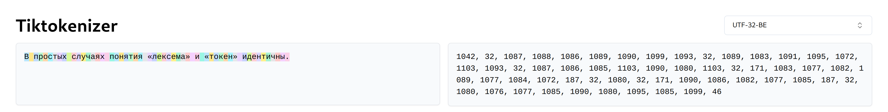
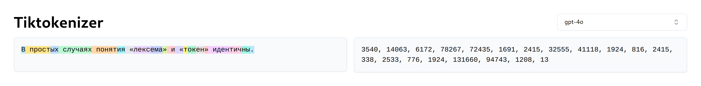

# This Title Is Already Tokenized

unicode is all you need
ai encoding uses language from -1000
from hieroglyphs to 
back from the prehistoric ages
this title is already tokenized

> `tokun` took tokens to t-can

in machine learning 3 worlds / visions are at odds: the computer, math and human sides.

tokenization bridges the gap from machine to tensors using human intuition, with algorithms like BPE.

in my [previous article][huggingface-tokenization-1], I proposed to train a model to translate / compress the encoding bytes into embeddings.

Actually, none of this is necessary since any digital text has already an encoding which can directly be used as embedding.

from encoding to embedding

## TLDR

=> composite embeddings in the last section

INPUT = composite embeddings =
- sequence compression by arbitrary factor
- numeric proximity <=> semantic similarity

OUTPUT = binary predictions leverage the numeric locality != categorical (softmax) predictions





## Intuition

Russian translation of `In simple cases, the concepts of "lexeme" and "token" are identical`:

```
В простых случаях понятия «лексема» и «токен» идентичны.
```

56 UTF-32 codepoints:

```
[1042, 32, 1087, 1088, 1086, 1089, 1090, 1099, 1093, 32, 1089, 1083, 1091, 1095, 1072, 1103, 1093, 32, 1087, 1086, 1085, 1103, 1090, 1080, 1103, 32, 171, 1083, 1077, 1082, 1089, 1077, 1084, 1072, 187, 32, 1080, 32, 171, 1090, 1086, 1082, 1077, 1085, 187, 32, 1080, 1076, 1077, 1085, 1090, 1080, 1095, 1085, 1099, 46]
```

224 UTF-32-BE bytes:

```
[0, 0, 4, 18, 0, 0, 0, 32, 0, 0, 4, 63, 0, 0, 4, 64, 0, 0, 4, 62, 0, 0, 4, 65, 0, 0, 4, 66, 0, 0, 4, 75, 0, 0, 4, 69, 0, 0, 0, 32, 0, 0, 4, 65, 0, 0, 4, 59, 0, 0, 4, 67, 0, 0, 4, 71, 0, 0, 4, 48, 0, 0, 4, 79, 0, 0, 4, 69, 0, 0, 0, 32, 0, 0, 4, 63, 0, 0, 4, 62, 0, 0, 4, 61, 0, 0, 4, 79, 0, 0, 4, 66, 0, 0, 4, 56, 0, 0, 4, 79, 0, 0, 0, 32, 0, 0, 0, 171, 0, 0, 4, 59, 0, 0, 4, 53, 0, 0, 4, 58, 0, 0, 4, 65, 0, 0, 4, 53, 0, 0, 4, 60, 0, 0, 4, 48, 0, 0, 0, 187, 0, 0, 0, 32, 0, 0, 4, 56, 0, 0, 0, 32, 0, 0, 0, 171, 0, 0, 4, 66, 0, 0, 4, 62, 0, 0, 4, 58, 0, 0, 4, 53, 0, 0, 4, 61, 0, 0, 0, 187, 0, 0, 0, 32, 0, 0, 4, 56, 0, 0, 4, 52, 0, 0, 4, 53, 0, 0, 4, 61, 0, 0, 4, 66, 0, 0, 4, 56, 0, 0, 4, 71, 0, 0, 4, 61, 0, 0, 4, 75, 0, 0, 0, 46]
```

## Notice

will start with specific issues and progressively build a new system. 

In the following sections, I have minimized the interface of [Tiktokenizer][tiktokenizer-gpt-4], but the data is still accurate.

western language
interested on perspective other culture / continent

## Tokenization And Ancient Languages

essentially, tokenization merges individual characters (bytes) into monolithic tokens.
here, the 56 cyrillic characters are grouped into 20 tokens:



LLMs are only aware of the index values on the right and lose the information on token composition.
Our numbers are all composed of the same 10 digits; imagine having [a different symbol for each number][twitter-karpathy-emojis]!

The early written languages like hieroglyphs
They further developped
Ancient languages like Egyptian had 
Such schemes are called logographic languages
most languages evolved from this stage

compose from simpler elements
=> alphabetic and syllabic

Most modern languages have composition rules

more generally this is the concept of 

humans can't remember a million symbols and machines would like to avoid wasting resources on BS
(mindful)


## Representing The Predictions

Suppose GPT-4o processed the following sentence:

```
This paper was based mainly on the attention mechanism developed by Bahdanau et al. in 2014.[11]
```

For each position in the sequence, the model outputs a vector of probabilities for the next token.
Given every before, the prediction for the token "201" might look like this:

| Index         | 0     | ...   | 290   | ...   | 667   | ...   | 1179  | ...   | 1323  | ...   | 34902         | ...   | 199,997   |
| ------------- | ----- | ----- | ----- | ----- | ----- | ----- | ----- | ----- | ----- | ----- | ------------- | ----- | --------- |
| Token         | "!"   | ...   | the   | ...   | 201   | ...   | 200   | ...   | 202   | ...   | " september"  | ...   | " cocos"  |
| Target        | 0     | ...   | 0     | ...   | 1     | ...   | 0     | ...   | 0     | ...   | 0             | ...   | 0         |
| Prediction    | 0     | ...   | 0.15  | ...   | 0.4   | ...   | 0.1   | ...   | 0.25  | ...   | 0.08          | ...   | 0         |

This one-hot vector has a dimension of 200k and is usually obtained with softmax

instead, every number below 200k can be represented with just 18 bits.
switching the activation from softmax to a sigmoid:

| Index         | 0     | 1     | 2     | 3     | 4     | 5     | 6     | 7     | 8     | 9     | 10    | 11    | 12    | 13    | 14    | 15    | 16    | 17    |
| ------------- | ----- | ----- | ----- | ----- | ----- | ----- | ----- | ----- | ----- | ----- | ----- | ----- | ----- | ----- | ----- | ----- | ----- | ----- |
| Target        | 1     | 1     | 0     | 1     | 1     | 0     | 0     | 1     | 0     | 1     | 0     | 0     | 0     | 0     | 0     | 0     | 0     | 0     |
| Prediction    | 0.6   | 0.58  | 0.55  | 0.7   | 0.64  | 0.37  | 0.2   | 0.8   | 0.25  | 0.9   | 0.08  | 0.12  | 0.04  | 0.1   | 0.02  | 0     | 0     | 0     |

the head layer would have a kernel of 
more importantly, each bit prediction is informed by many more neurons
embed = 4096 = >

The binary vector above encodes the prediction "671": 
With this output scheme, prediction errors are numerically closer (the model puts more emphasis on significant bits).

unfortunately, the vocabulary of tokenizers are chaotic: numeric proximity is unrelated to semantic similarity.
tokens surrounding "201" in o200k: " can", "п", "201", " me", " с", b"\xe0\xb3".

error = close numeric prediction
would like that numeric proximity <=> semantic similarity

output = probability of next token, by index
softmax = one true

binary error => close prediction
but, close tokens are unrelated
=> other input repr

## Language Basis

- computer: sequence => codepoint => byte => bits
- math: tensors => axes => dimensions
- human: paragraph => sentence => word => symbols / letters

common denominator = the macro elements all break down into simpler parts.
while there are the number of possible macro elements grows exponantially, there are very few basis elements:

- computer: 2 bits
- human: 26 lowercase letters and a few symbols for Latin languages
- math: real numbers, actually infinite

all these schemes take advantage of the rules of combinatorics

tokenization = opposite!
base elements are 

## Input Representation

unicode is very structured => position is strongly correlated with composition

composition = form of similarity:

- word type (gerundive, verbs, tense have markers)
- declinations (plurals, etc)

all examples: 16 characters = 16 UTF-32 codepoints = 64 UTF-32 bytes

### Features = Sequence Of Codepoints

| PCA                       | UMAP                         |
| ------------------------- | ---------------------------- |
| ![][image-pca-codepoints] | ![][image-umap-codepoints]   |

cons:

- there are 262144 "basic" elements, similar to regular tokenizer vocabularies
- single value with delta = 1 / 0x40000 = 3.8147e-06 => little separation between codepoints

#### Pros

- standard: shared worldwide
- international: all languages are covered
- native: no training required
- compression: smallest tensor size possible
- fixed: all tokens have the same dimension, chosen freely
- structured: Unicode has 
- numbers: the encoding is correlated to actual number values
- composition: embeddings now 

#### Cons

- brittle: small changes

### Features = Sequence Of Bytes

| PCA                  | UMAP                   |
| -------------------- | ---------------------- |
| ![][image-pca-bytes] | ![][image-umap-bytes]  |

### NOT binary

the 256 byte values play a specific role, while the 0 and 1 have the same meaning.

for example the byte "0" is padding.

### Features = Composite Embeddings

| PCA                       | UMAP                          |
| ------------------------- | ----------------------------- |
| ![][image-pca-composite]  | ![][image-umap-composite]     |

- byte / 256
- codepoint / 0x40000
- byte sequence = embedding index => unrelated embeddings (rather than smooth function)

## Objectives / Ideal

- reduce the sequence length: faster processing, less resources
- give "meaning"
- avoid "meaningless" predictions and constrain to

desired properties:

- compression
- proximity
- composition
- timeless: concepts and dates appear more / less frequently depending on the period

## Next

LLMs are still in the stone age

why / how did tokenization last so long?

compiler + llm using tokun embeddings

better representation?

[huggingface-tokenization-1]: https://huggingface.co/blog/apehex/tokenization-is-a-dead-weight
[image-pca-bytes]: .images/projector/bytes.pca.gif
[image-umap-bytes]: .images/projector/bytes.umap.gif
[image-pca-codepoints]: .images/projector/codes.pca.gif
[image-umap-codepoints]: .images/projector/codes.umap.gif
[image-pca-composite]: .images/projector/compo.pca.gif
[image-umap-composite]: .images/projector/compo.umap.gif
[tiktokenizer-gpt-4]: https://tiktokenizer.vercel.app/?model=gpt-4
[twitter-karpathy-emojis]: https://x.com/karpathy/status/1816637781659254908
