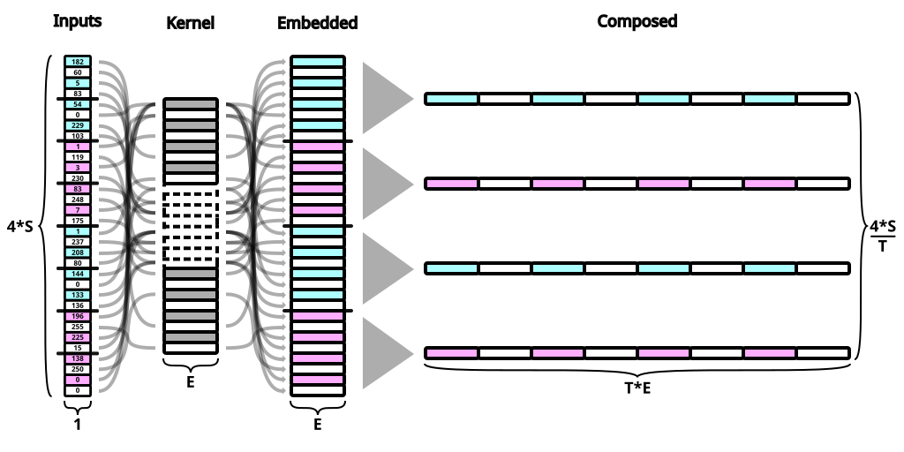

# This Title Is Already Tokenized (Tokun Part 2)


> `tokun` took tokens to t-can

In machine learning 3 worlds / visions are at odds: the computer, math and human sides.

Tokenization bridges the gap from machine encoding to tensor embeddings using human intuition, with algorithms like BPE.

In my [previous article][huggingface-tokenization-1], I proposed to train a model to translate / compress the encoding bytes into embeddings.

Actually, none of this is necessary: Unicode can be used as the basis for LLM embeddings.

## TLDR

=> composite embeddings in the last section

instead of building monolithic and unrelated embeddings:
- split
- embed the bytes
- merge the byte embeddings into a token embedding

embeddings built on the Unicode structure



It's extremely surprising to me that this isn't the standard, considering:

out of the 3 input embeddings, composite embeddings achieve:
- sequence compression by arbitrary factor
- numeric proximity <=> semantic similarity

you will find a detailed explanation for each of these points [below](#comparison-with-tokenization).

- standard: Unicode is shared worldwide, while vocabularies are specific to regions / models
- international: all languages are covered
- native: no training required
- compression: smallest tensor size possible
- fixed: all tokens have the same dimension, chosen freely
- structured: Unicode has 
- numbers: the encoding is correlated to actual number values
- composition: embeddings now 
- timeless: the Unicode standard has little variations over time

- arbitrary token length: hyper-parameter

- reduce the sequence length: faster processing, less resources
- give "meaning"
- avoid "meaningless" predictions and constrain to

desired properties:

- compression
- proximity
- composition
- timeless: concepts and dates appear more / less frequently depending on the period

OUTPUT = binary predictions leverage the numeric locality != categorical (softmax) predictions

instead of predicting an index out of 200k, predict the base 2 representation of the index


more specifically, this scheme is especially suited to predict byte values: each can be represented in base 2 by a vector of **dimension 8**.

suppose the token dimension is set to 16 characters, that's 64 bytes to predict per token or a vector of dimension 512.

All in all,

## TOC

- [Tokenization And Ancient Language](#tokenization-and-ancient-languages)
- [Binary Predictions](#binary-predictions)
- [Language Basis](#language-basis)
- [Unicode Embeddings](#codepoint-embeddings)
    - [Codepoint Embeddings](#codepoint-embeddings)
    - [Byte Embeddings](#byte-embeddings)
- [Composite Embeddings](#composite-embeddings)
- [Implementation](#implementation)
- [Comparison With Tokenization](#comparison-with-tokenization)
    - [Compression](#compression)
    - [Errors](#errors)
- [Next](#next)

## Notice

western language
interested on perspective other culture / continent

## Tokenization And Ancient Languages

Essentially, tokenization merges individual characters (bytes) into monolithic chunks.
Here, 56 cyrillic characters are grouped into 20 tokens:


LLMs are only aware of the index values on the right and lose the information on token composition.

Imagine using a [unique symbol for every number and word variation][twitter-karpathy-emojis]!

The early written languages like hieroglyphs started with such logograms, but they still had rebus rules to form nuanced meanings out of combinations of symbols.

For example the plural form is obtained by tripling a logogram or adding 3 bars next to it:
"house" is "𓉐" and "houses" is "𓉐 𓏪".

Meanwhile o200k has "house" (4276), " House" (7826), "house" (9983), " houses" (20327), "House" (27796), "-house" (46400) etc.

Most modern languages developped rules to derive new meanings from **combinations** of symbols.

In particular, phonetic and positional systems allow to compose words and numbers.
And the composition of a word gives many indications on its meaning.

The Unicode standard indexed 149813 symbols from 161 scripts.
It is an obvious basis to build embeddings.

## Binary Predictions

Suppose GPT-4o processed the following sentence:

```
This paper was based mainly on the attention mechanism developed by Bahdanau et al. in 2014.[11]
```

For each position in the sequence, the model outputs a vector of probabilities for the next token.
Given every before, the prediction for the token "201" might look like this:

| Index         | 0     | ...   | 290       | ...   | 667   | ...   | 1179  | ...   | 1323  | ...   | 34902         | ...   | 199,997   |
| ------------- | ----- | ----- | --------- | ----- | ----- | ----- | ----- | ----- | ----- | ----- | ------------- | ----- | --------- |
| Token         | `!`   | ...   | ` the`    | ...   | `201` | ...   | `200` | ...   | `202` | ...   | ` september`  | ...   | ` cocos`  |
| Target        | 0     | ...   | 0         | ...   | 1     | ...   | 0     | ...   | 0     | ...   | 0             | ...   | 0         |
| Prediction    | 0     | ...   | 0.15      | ...   | 0.4   | ...   | 0.1   | ...   | 0.25  | ...   | 0.08          | ...   | 0         |

This one-hot vector has a dimension of 200k and is usually obtained with either:

- a softmax
- dot projection

instead, every number below 200k can be represented with **just 18 bits**.
the target index `667` for the next token "201" is `110110010100000000` in base 2.

each bit can be predicted by an **independent probability** by switching the activation from softmax to a **sigmoid**:

| Index         | 0     | 1     | 2     | 3     | 4     | 5     | 6     | 7     | 8     | 9     | 10    | 11    | 12    | 13    | 14    | 15    | 16    | 17    |
| ------------- | ----- | ----- | ----- | ----- | ----- | ----- | ----- | ----- | ----- | ----- | ----- | ----- | ----- | ----- | ----- | ----- | ----- | ----- |
| Target        | 1     | 1     | 0     | 1     | 1     | 0     | 0     | 1     | 0     | 1     | 0     | 0     | 0     | 0     | 0     | 0     | 0     | 0     |
| Prediction    | 0.6   | 0.58  | 0.55  | 0.7   | 0.64  | 0.37  | 0.2   | 0.8   | 0.25  | 0.9   | 0.08  | 0.12  | 0.04  | 0.1   | 0.02  | 0     | 0     | 0     |

the head layer would have a kernel of 
more importantly, each bit prediction is informed by many more neurons
embed = 4096 = >

The binary vector above encodes the prediction "671": 
With this output scheme, prediction errors are numerically closer (the model puts more emphasis on significant bits).

unfortunately, the vocabulary of tokenizers are chaotic: **numeric proximity** is unrelated to **semantic similarity**.
tokens surrounding "201" in o200k: " can", "п", "201", " me", " с", b"\xe0\xb3".

error = close numeric prediction
would like that numeric proximity <=> semantic similarity

output = probability of next token, by index
softmax = one true

binary error => close prediction
but, close tokens are unrelated
=> other input repr

## Language Basis

- computer: sequence => codepoint => byte => bits
- math: tensors => axes => dimensions
- human: paragraph => sentence => word => symbols / letters

common denominator = the macro elements all break down into simpler parts.
while there are the number of possible macro elements grows exponantially, there are very few basis elements:

- computer: 2 bits
- human: 26 lowercase letters and a few symbols for Latin languages
- math: real numbers, actually infinite

all these schemes take advantage of the rules of combinatorics

tokenization = opposite!
base elements are 

## Unicode Embeddings

unicode is very structured => position is strongly correlated with composition

composition = form of similarity:

- word type (gerundive, verbs, tense have markers)
- declinations (plurals, etc)

all examples: 16 characters = 16 UTF-32 codepoints = 64 UTF-32 bytes

### Codepoint Embeddings

A first approximation for semantic similarity is composition.
Indeed:

Each token index is equivalent to the sequence of Unicode codepoints.
The latter is actually a new composite index that is more informative:

| Position      | Token         | o200k     | UTF-32-BE                                 |
| ------------- | ------------- | --------- | ----------------------------------------- |
| 0             | `M`           | `44`      | `(77)`                                    |
| 1             | `inds`        | `13834`   | `(105, 110, 100, 115)`                    |
| 2             | ` aren't`     | `23236`   | `(32, 97, 114, 101, 110, 39, 116)`        |
| 3             | ` read`       | `1729`    | `(32, 114, 101, 97, 100)`                 |
| 4             | `.`           | `13`      | `(46)`                                    |
| ...           | ...           | ...       | ...                                       |

Now that all the indexes are Unicode, there is no reason to keep the uneven chunks:

| Position  | Chunk         | UTF-32-BE             | Embeddings                                            |
| --------- | ------------- | --------------------- | ----------------------------------------------------- |
| 0         | `Mind`        | `(77, 105, 110, 100)` | `(0.00029373, 0.00040054, 0.00041962, 0.00038147)`    |
| 1         | `s ar`        | `(115, 32, 97, 114)`  | `(0.00043869, 0.00012207, 0.00037003, 0.00043488)`    |
| 2         | `en't`        | `(101, 110, 39, 116)` | `(0.00038528, 0.00041962, 0.00014877, 0.0004425 )`    |
| 3         | ` rea`        | `(32, 114, 101, 97)`  | `(0.00012207, 0.00043488, 0.00038528, 0.00037003)`    |
| ...       | ...           | ...                   | ...                                                   |

This operation might look banal, but we moved data from the sequence axis to the feature axis!
Now, the table is looking like an actual embedding tensor!

After normalizing the values, the codepoints can be directly treated as embeddings.
And the "tokens" can be made arbitrarily long:

| Position  | Chunk             | UTF-32-BE                                 | Embeddings                                                                    |
| --------- | ----------------- | ----------------------------------------- | ----------------------------------------------------------------------------- |
| 0         | `Minds ar`        | `(77, 105, 110, 100, 115, 32, 97, 114)`   | `(2.94e-4, 4.01e-4, 4.20e-4, 3.81e-4, 4.39e-4, 1.22e-4, 3.70e-4, 4.35e-4)`    |
| 1         | `en't rea`        | `(101, 110, 39, 116, 32, 114, 101, 97)`   | `(3.85e-4, 4.20e-4, 1.49e-4, 4.43e-4, 1.22e-4, 4.35e-4, 3.85e-4, 3.70e-4)`    |
| ...       | ...               | ...                                       | ...                                                                           |

Now the length of the sequence chunks ("tokens") is a hyper-parameter like the number of layers in a model.

These vectors have a lot of information embedded.
Dimensionality reduction shows how the vectors made from similar characters are close:

| PCA                       | UMAP                         |
| ------------------------- | ---------------------------- |
| ![][image-pca-codepoints] | ![][image-umap-codepoints]   |

Since the standard defines the Unicode space into themed ranges of values, the embeddings are natively correlated with content.
For example there are regions for each character set (Latin, Cyrillic, ), for emojis, for symbols, for special characters, etc.

For more informations see:

- the Wikipedia article on [Unicode planes][wikipedia-unicode-planes]
- the Unicode table at [symbl.cc][symbl-blocks]

These normalized embeddings would serve as input tensor for a LLM which can then extend the embedding dimension for further processing.

This scheme inherits from the properties of Unicode and has already most of the advantages [listed in the TLDR](#tldr).

The last point is made in contrast with the training of current tokenizer, where the tokens depend on the frequency of combinations of symbols.
For example "2024" will not be as frequent in 20 years, new words and proper nouns will appear, etc.

Still, there is a lot to improve too:

- brittle: the embedding values are very precise and they are separated by `1 / 0x40000 = 3.8147-06` only
- there are 262144 "basic" elements, similar to regular tokenizer vocabularies
- linearity: the embeddings are regularly spaced even though certain codepoints have very different meanings from their neighbors

### Byte Embeddings

| Position  | Chunk         | UTF-32-BE                                                     | Embeddings                                                                |
| --------- | ------------- | ------------------------------------------------------------- | ------------------------------------------------------------------------- |
| 0         | `Mind`        | `(0, 0, 0,  77, 0, 0, 0, 105, 0, 0, 0, 110, 0, 0, 0, 100)`    | `(0 0 0 0.30078125 0 0 0 0.41015625 0 0 0 0.4296875 0 0 0 0.390625)`      |
| 1         | `s ar`        | `(0, 0, 0, 115, 0, 0, 0,  32, 0, 0, 0,  97, 0, 0, 0, 114)`    | `(0 0 0 0.44921875 0 0 0 0.125 0 0 0 0.37890625 0 0 0 0.4453125)`         |
| 2         | `en't`        | `(0, 0, 0, 101, 0, 0, 0, 110, 0, 0, 0,  39, 0, 0, 0, 116)`    | `(0 0 0 0.39453125 0 0 0 0.4296875 0 0 0 0.15234375 0 0 0 0.453125)`      |
| 3         | ` rea`        | `(0, 0, 0,  32, 0, 0, 0, 114, 0, 0, 0, 101, 0, 0, 0,  97)`    | `(0 0 0 0.125 0 0 0 0.4453125 0 0 0 0.39453125 0 0 0 0.37890625)`         |
| ...       | ...           | ...                                                           | ...                                                                       |

There are a lot of zeros because all the characters from the example come from the ASCII table, which is right at the start of the Unicode table.
For example "Unicode" is "유니코드" in Korean which is encoded as `(0, 0, 199, 32, 0, 0, 178, 200, 0, 0, 207, 84, 0, 0, 180, 220)` in UTF-32-BE.

Rather than dividing by `0x40000`, each byte can be normalized by `256`.

The structure of Unicode is even more apparent with these embeddings:

| PCA                  | UMAP                   |
| -------------------- | ---------------------- |
| ![][image-pca-bytes] | ![][image-umap-bytes]  |

This transformation solves 2 of the shortcomings of the previous method:

- embeddings are composed from 256 base elements rather than 200k
- there is more separation between values

Still, the embeddings are lineary distributed.
It would be better to distinguish special values, in particular the null byte.

Traditional embeddings are totally independent and arbitrary.
Could this feature be mixed with base decomposition?

## Composite Embeddings

The previous embedding mapped each byte with its value divided by 256.

Actually, the integer bytes can be interpreted as an index in a traditional embedding layer.
After concatening the embeddings from each byte, a "token" embedding is formed.

Even with random vectors for each byte, the merged embeddings keep the information on token composition:

| PCA                       | UMAP                          |
| ------------------------- | ----------------------------- |
| ![][image-pca-composite]  | ![][image-umap-composite]     |

Now, the "token" length is a hyper-parameter of the model.
The Gemma2-27B architecture could be tweaked like this:

- the embed dimension `E` is kept at 4608
- the token dimension `T` is set to 64 (bytes, which amount to 16 Unicode characters)
- the byte dimension `C` is then 4608 / 64 = 72
- the context dimension `S` and all other values remain the same

Then an input tensor with a batch dimension `B` of 128 and sequence dimension of 16384 (4096 characters) would be:

- first reshaped as `(128, 256, 64)`
- and exit the composite embedding layer as a tensor of shape `(128, 256, 4608)`

The LLM would process the input as a sequence of 256 embeddings, each representing 16 characters.

And each of these embeddings is actually made from the concatenation of 64 byte embeddings.

Now the LLM knows the composition of each token and can natively perform calculations, create and understand "out-of-vocabulary" words, etc.

## Implementation

The composite embeddings can be implemented in a very simple layer.
For example, in Keras:

```python
@keras.saving.register_keras_serializable(package='layers')
class TokunEmbedding(keras.layers.Embedding):
    def call(self, inputs: keras.Input) -> keras.Input:
        # embed each element separately
        __outputs = super(TokunEmbedding, self).call(inputs)
        # concatenate the embeddings
        return keras.ops.einsum('bste -> bs(te)', __outputs)
```

The `einsum` operation could be replaced with a more generic "merge" operation independent of the rank of its input.

The targets for the binary predictions are calculated by decomposing the inputs in base 2:

```python

```

During inference, the predictions can be interpreted by doing the reverse operation:

```python

```

This layer can then be trained and the embeddings for each byte can be adjusted by the model.

It allows the model to set an independent meaning to each byte, contrary to the two schemes in the sections above.

## Comparison With Tokenization

The following hyper parameters are set for all the comparisons below:

- batch dimension
- context dimension
- embedding dimension

### Localization

byte representations based on the unicode standard:

### Training

none

### Overall Process

### Compression Of Inputs, Outputs And Weights

token dimension = choice

- kernel size
- input size
- output size

### Prediction Errors

close numeric errors <=> close semantic error

one advantage of tokenization = pick their predictions among a predefined vocabulary, which guarantees that each position has a meaningful (sub)word.

on the contrary, these embeddings and prediction schemes can generate errors at the character level.
in practice, it is not disturbing since our brain automatically corrects typos and interprets text in chunks.

## Next

LLMs are still in the stone age

why / how did tokenization last so long?

compiler + llm using tokun embeddings

can these embedding and prediction techniques be further improved?

[huggingface-tokenization-1]: https://huggingface.co/blog/apehex/tokenization-is-a-dead-weight
[image-pca-bytes]: .images/projector/bytes.pca.gif
[image-umap-bytes]: .images/projector/bytes.umap.gif
[image-pca-codepoints]: .images/projector/codes.pca.gif
[image-umap-codepoints]: .images/projector/codes.umap.gif
[image-pca-composite]: .images/projector/compo.pca.gif
[image-umap-composite]: .images/projector/compo.umap.gif
[symbl-blocks]: https://symbl.cc/en/unicode/blocks/
[tiktokenizer-gpt-4]: https://tiktokenizer.vercel.app/?model=gpt-4
[twitter-karpathy-emojis]: https://x.com/karpathy/status/1816637781659254908
[wikipedia-unicode-planes]: https://en.wikipedia.org/wiki/Plane_(Unicode)
